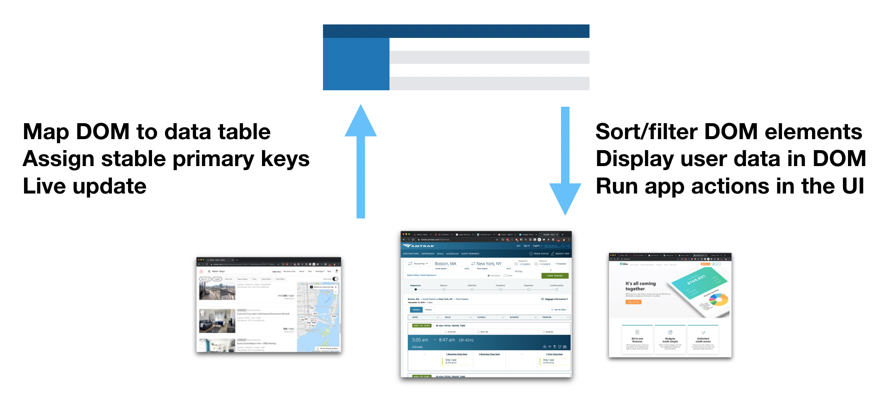

Main notes for DNJ:

* design principles: categorization? Is something missing?
* naming core concepts. 
	* casual programming
	* DM by proxy

# Introduction

In 2012, the travel site Airbnb removed the ability to sort listings by price. Users could still filter down to a price range, but could no longer view the cheapest listings first. Many users complained on online message boards that the change seemed hostile to users. "It's so frustrating!..What is the logic behind not having this function?" said one user on the [Airbnb support forum](https://community.withairbnb.com/t5/Hosting/Sorting-listing-by-price/td-p/559404). Alas, the feature remains missing to this day.

This is a familiar situation in a world of web applications that are frequently updated without user consent. For most people, when web software does not quite meet their needs, their only recourse is to complain to the developers and hope someone listens. If they know how to program in Javascript, perhaps they can implement a user script or a browser extension to patch the issue, but most people do not have these programming skills. While many have become accustomed to this status quo, we see it as a waste of the openness of the Web platform and the general pliability of software. In _Personal Dynamic Media_, Alan Kay envisioned personal computing as a medium that let a user "mold and channel its power to his own needs," but today's software is far from this vision. Enabling users to tweak web applications without programming would be a substantial step towards making software more malleable.

In this paper, we introduce Wildcard^[Wildcard was the original internal name for Hypercard, which promoted both software modification by end users, and many of the ideas underlying the modern Web.], a browser extension that aims to meet this need. Wildcard adds a panel to the bottom of a web page that shows a structured table view of the main data in the page. The table maintains a bidirectional connection to the original page—when the user manipulates the table, the original page gets modified, and vice versa.

In Wildcard, a user can sort Airbnb listings with just one intuitive click on a table header, with no programming required. Beyond sorting and filtering data, Wildcard also supports accessing third party APIs, performing small computations, recording private user annotations, using alternate UI widgets, and other useful changes. While Wildcard does not support all changes someone might want to make to a website, it makes broad subset of changes easily accessible to end users.

Under the hood, the implementation is straightforward, because a programmer must manually write an adapter for each individual website, which uses traditional web scraping techniques to map the web page to the table. While programming is required for part of the process, this is still very different from traditional browser extensions—instead of the programmer defining a narrow use case, the end user is able to make many different changes on top of a single site-specific adapter.

In this paper, we present examples of using Wildcard to solve real world problems, and explain the design principles behind the prototype. In the future, we envision building Wildcard into a fully deployed system that makes the web into a more malleable medium.

# Demo: Booking a trip with Wildcard

To get a sense of the experience of using Wildcard, let's see an example of modifying a website with Wildcard.

Here, the user is on the Airbnb search results page, which does not allow the user to sort by price. The user simply opens up the data table and clicks the price column header. Note that, in addition to sorting the table, the entries also become sorted in the page itself.

<video width="100%" src="media/airbnb-sort.mp4" autoplay loop muted playsinline controls class>
</video>

For example, in @Fig:table we open up a table view that corresponds to search results on the Airbnb travel site.

{#fig:table}

_Todo: fill in the rest of the section with similar video demos._

# System Implementation

_Goal of this section: briefly explain the current implementation. Just enough detail to ground further discussion._ {#fig:adapter}

* Built as a Greasemonkey script for now (_todo: convert to a full browser extension?_)
* Describe the adapter API
	* show a snippet of adapter code
	* discuss how easy it is for programmers to make adapters
	* discuss possible future automation of adapter creation
* Mention the technique of scraping data from AJAX requests
* future implementation goals
	* make it easy for programmers to add adapters + plugins, and distribute them to users. (Currently all adapters + plugins are part of the main Wildcard codebase)

# Design principles

The design of Wildcard is grounded in several principles, informed by prior work and our own experimentation. We hope you find these principles helpful not only for understanding our prototype, but also for designing other systems for end user programming.

## Decouple UI from data

Most software does not allow users to choose their own UI elements, even for common data types. If a website provides a datepicker widget, you have no ability to provide your own replacement datepicker, with your preferred design or with privileged access to your private calendar data. This forces users to learn many different interfaces of varying quality for similar tasks. Some websites have APIs to allow users to access the data underlying the UI, but in addition to requiring programming, these are heavyweight tools more fit for batch exports or building entire new clients than for casual UI modification. 

In Wildcard, a user gets access to a view of the underlying data in the page, and can choose their own interfaces to view and modify the data. The Expedia datepicker demo showed one example of how this can be useful, but we also envision creating other widgets for visualizing and editing data. Some examples would be showing geographic data in a custom map that includes the user's own annotations, or editing a blog post in a rich text editor of the user's choice.

One benefit of decoupling data from interfaces is improved UI quality. When UI widgets can compete on their merits rather than based on network effects from the data they have access to, it creates much stronger competition at the interface level. For example, there is competition among email clients (which consume an open protocol), but not among Facebook or Twitter clients. This benefit relates to the SOLID project led by Tim Berners-Lee [@berners-lee2018], which envisions user-controlled data as a mechanism for decoupling data from interfaces, e.g. giving users a choice of which client to use to consume a given social media feed. Wildcard has overlapping goals with SOLID, but does not require decentralized user control of data—the data can remain on a centralized server, as long as the interface can be tweaked by end users.

Another benefit of decoupling data from UI is that it becomes possible to use the same consistent interface across many applications. For example, many programmers become deeply familiar with one text editor and use it for many different kinds of tasks, even as an interactive input mechanism in the shell (e.g. for editing git commit messages). The ability to generically reuse the text editor in many contexts makes it worth investing time in mastering the tool. Beaudouin-Lafon and Mackay refer to this ability to use a UI tool in many contexts as _polymorphic_ interaction [@beaudouin-lafon2000], noting that it is a useful technique for keeping interfaces simple while increasing their power. diSessa also  [@disessa2000] notes that there is a connection between polymorphism and the idea of literacy in a medium: textual literacy rests on a single rich medium of writing which can be adapted to many different genres and uses. 

_Note: Maybe could relate this section to Concept Reuse?_

## Expose structure

In *Changing Minds* [@disessa2000], Andrea diSessa critiques the design of modern software with a story about a hypothetical "nightmare bike." Each gear on the nightmare bike is labeled not with a number, but with an icon describing its intended use: smooth pavement uphill, smooth pavement downhill, gravel, etc. This might seem more "user-friendly" than numbered gears, but in fact, it makes it harder to operate the bike. A numerical sequence allows the user to develop intuition for the structure of the system, but isolated modes provide a superficial understanding with no grounding in structure. This understanding might be sufficient for the most common cases but breaks down in unfamiliar situations. If someone needs to go uphill on gravel, do they need to try every mode at random?

Many modern software designs fall into this trap, teaching users to use isolated modes rather than coherent structure, and the problem gets far worse when operating across multiple applications. Unlike the UNIX philosophy of small tools interoperating through shared abstractions, in modern computing each application is in its own silo of data and functionality.

Wildcard helps people understand and modify the behavior of applications through the lens of a consistent abstraction: a data table. This abstraction strikes a balance between being both simple and generic. A data table is simpler than the DOM tree that describes the details of the UI, but is also generic enough to describe the essence of many different kinds of applications.

Creating a structured abstraction to represent a web page is a deliberate choice, and is not the only way to enable users to modify websites without directly accessing the DOM. Systems like Chickenfoot [@bolin2005] and CoScripter [@leshed2008] allow users to create scripts in an informal language and then perform fuzzy pattern matching to find elements in the DOM. For example, to find a button after a textbox in Chickenfoot, the user could type `click(find(“button just after textbox”))`. These designs allow for expressing a wide range of operations, but they don't explicitly indicate what operations are possible—the user can only see the original page and imagine the possibilities. In contrast, Wildcard provides affordances that clearly suggest the availability of certain actions (e.g. sorting, editing a cell, adding a column with a derived value), especially to users who are familiar with spreadsheets. In addition to giving users more certainty about whether a modification is possible, these affordances might give users new ideas for things to try. Just as graphical interfaces better communicate the space of possible actions than command line interfaces, Wildcard aims to clearly communicate the space of possible modifications. 

## Direct manipulation of an alternate representation

In Wildcard, users manipulate an alternate representation of a web page. The interaction with the data table is direct like using a spreadsheet, but the interaction with the page is indirectly mediated through the table.

We considered other approaches where the user would interact more directly with the original UI, e.g. injecting sort controls into the page, but decided that the table view had advantages that justified the cost of adding a layer of indirection:

* _Consistency_: Even across different websites, the table view always has the same layout, making it easier to learn to use.
* _Affordances_: The table view suggests possible actions like adding a new column, which are challenging to suggest in the context of the original page.
* _Blank slate for UI_: When a custom UI element is used to manipulate a cell in the data table, there are no conflicts with the existing interface of the site.

The main challenge of making this design successful is maintaining a close mapping in the user's mind between the new representation and the original page (_note: cite Norman? Cognitive Dimensions 'closeness of mapping'?_). Wildcard provides live visual cues as the user navigates the data table, similar to the highlighting provided by browser developer tools to indicate the mapping between HTML and the original page. In practice in our own usage, we have found that this live highlighting is sufficient to make it clear how the two representations map to each other.

## Encourage casual tweaking

------------------------      ------------------         ----------------------------------------
                              *Casual*                   *Not casual*
*End user friendly*           **Wildcard**               IFTTT
*Requires programming*        browser dev tools          editing open source desktop applications 
------------------------      -----------------          ----------------------------------------

We can evaluate a system for modifying software along two dimensions. First, the technical capability required of the user: is programming knowledge needed? Second, the level of effort required: how far out of their way the user must go to make a change? Can they casually make a small change, or do they need to make a larger project out of it? These dimensions are not orthogonal, but they are distinct. For example, setting up a workflow trigger in an end user programming system like [IFTTT](https://ifttt.com/) does not require much technical skill, but it does require leaving the user's normal software and entering a separate environment. On the other hand, running a Javascript snippet in the browser console requires programming skills, but can be done immediately and casually in the flow of using a website.

In addition to requiring no programming skills, Wildcard also aims to support frequent, small modifications. The Wildcard table appears in the course of normal web browsing, to ensure that the tools for modification are close at hand while using the original software. Ink and Switch refers to this property as having an "in-place toolchain" [@inkandswitch2019].

We also try to make simple changes possible with particularly low effort, like being able to sort a table in a single click. This property is inspired by spreadsheets, which can be useful even to someone who has learned only a small part of their functionality. In contrast, many traditional programming systems require someone to learn many complex concepts just to perform a simple task (e.g., needing to learn what `public static void main` means to write a Hello World program in Java).

## First party cooperation optional

The Web is an unusually extensible platform. On many other platforms (e.g. smartphone operating systems), software is locked down unless first-party developers explicitly provide hooks for plugins and interoperability, but on the Web, all client-side code is available for browser extensions to modify. Application authors can use practices that make it easier to modify their apps (e.g. clean semantic markup), or more difficult (e.g. code obfuscation), but the default state is openness. This gives extensions freedom to modify applications in creative ways that the original developers did not plan for.

Wildcard takes advantage of this openness, and does not depend on cooperation from first-party website developers. Any programmer can add support for any website to Wildcard by building a third party adapter. This design decision acknowledges the pragmatic need to interoperate with current websites, but we hope that eventually first party website developers will build in Wildcard support to their applications, since this would reduce the burden of maintaining adapters and make Wildcard plugins more stable.

Implementing the Wildcard adapter API could help developers by allowing users to fix some of their own issues, particularly idiosyncratic use cases that the first party developer would never plan to prioritize. Supporting Wildcard could be straightforward in a typical client-side application that already has access to a structured version of the data in the page. And while some developers might hesitate to promote extensibility in their clients to avoid unwanted changes, the most common problem of users blocking ads is already ground well trod by existing browser extensions. There is also precedent for first parties implementing an official client extension API in response to user demand: for several years, Google maintained an official extension API in Gmail for Greasemonkey scripts to use. (Incidentally, since then, third parties have continued to maintain Gmail extension APIs used by many Gmail browser extensions [@streak; @talwar2019], illustrating the value of collaboratively maintaining third party adapters.)

# Related work

_Note: a lot of this was already covered above; how to deal with that?_

* Malleable software: Kay, Webstrates
* Instrumental interaction, polymorphic UI
* Web automation: Chickenfoot, CoScripter
* Wrapper induction: Thresher, Helena
* Personal data ownership: SOLID
* Extension helper libraries, e.g. Gmail.js.

# Future work
* limitations / future ideas
	* the spreadsheet language is very primitive, can we make it more expressive? what are the exact semantics of fetching data from APIs? What about making API requests that do mutation, not just fetching data?
	* only works when the user is browsing. Should we explore triggers, scheduled scraping?
	* only has spreadsheet-style functional transformations. Should we explore imperative workflows? Injecting buttons into pages that do things? (Eg, imagine a "save to google maps" button that you can inject into a page)
	* limited options for how to style injected content, could explore styling (eg, maybe you can restyle a table cell and the styling is reflected when it's injected into the page?)
* still in early development; note the beta release plan (tentative: target public beta availability at the workshop in March?)
* Could explore automated wrapper induction, building on prior work
* Want to get more real usage of the tool and run usability studies
* Include a link to sign up for future updates