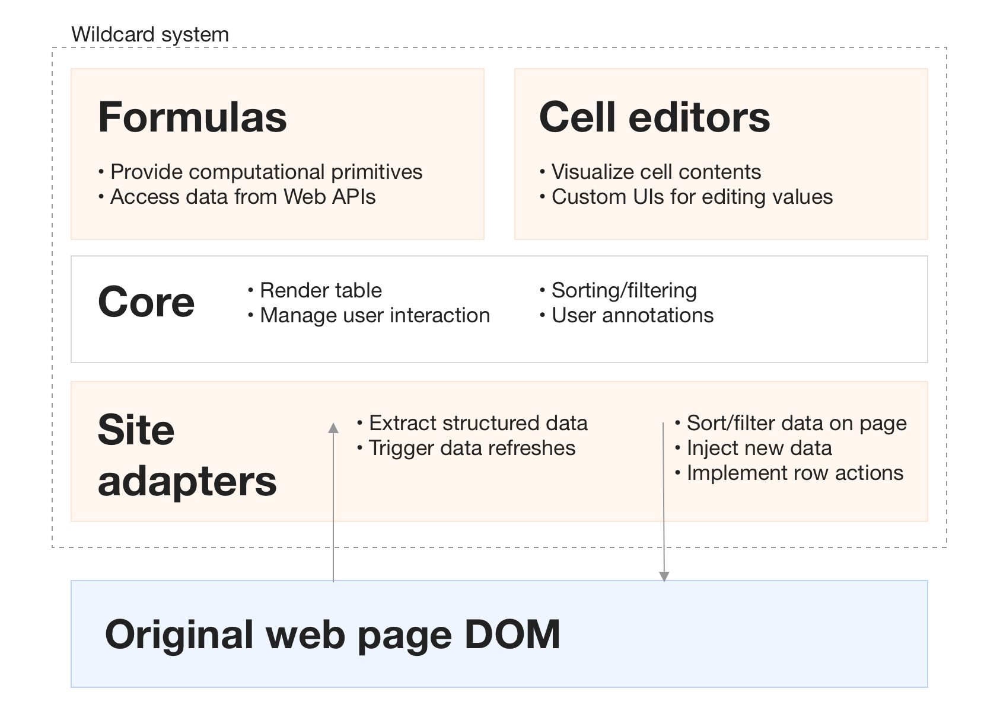

# Introduction

In 2012, the travel site Airbnb removed the ability to sort listings by price. Users could still filter down to a price range, but could no longer view the cheapest listings first. Many users complained on online message boards that the change seemed hostile to users. "It's so frustrating!..What is the logic behind not having this function?" said one user on the [Airbnb support forum](https://community.withairbnb.com/t5/Hosting/Sorting-listing-by-price/td-p/559404). Alas, the feature remains missing to this day.

This is a familiar situation in a world of web applications that are frequently updated without user consent. For most people, when web software does not quite meet their needs, their only recourse is to complain to the developers and hope someone listens. If they know how to program in Javascript, perhaps they can implement a user script or a browser extension to patch the issue, but most people do not have these programming skills. While many have become accustomed to this status quo, we see it as a waste of the openness of the Web platform and the general pliability of software. In _Personal Dynamic Media_, Alan Kay envisioned personal computing as a medium that let a user "mold and channel its power to his own needs," but today's software is far from this vision. 

In this paper, we introduce Wildcard^[Wildcard was the internal pre-release name for Hypercard, which served as an inspiration for this project since it promoted software modification by end users and was a precursor to the modern Web.], a browser extension that aims to make software more malleable by enabling users to tweak web applications without programming. Wildcard adds a panel to the bottom of a web page that shows a structured table view of the main data in the page. The table maintains a bidirectional connection to the original page—when the user manipulates the table, the original page gets modified, and vice versa.

In Wildcard, a user can sort Airbnb listings with just one intuitive click on a table header, with no programming required. Beyond sorting and filtering data, Wildcard also supports accessing third party APIs, performing small computations, recording private user annotations, using alternate UI widgets, and other useful changes. While Wildcard does not support all changes someone might want to make to a website, it makes broad subset of changes easily accessible to end users. 

Under the hood, the implementation is straightforward, because a programmer must manually write an adapter for each individual website, which uses web scraping techniques to map the web page to the table. _todo: mention the other bits of extension code too_ While programming is required for part of the process, this is still very different from traditional browser extensions—instead of the programmer defining a narrow use case, the end user is able to make many different changes on top of a single site-specific adapter. Programmers can extend Wildcard with plugins which provide various bits of functionality including connecting it to specific websites and web APIs, but the end user never needs to do any traditional programming.

_note the current prototype stage_

In this paper, we present examples of using Wildcard to solve real world problems, and explain the design principles behind the prototype:

_todo: bullet point the design principles here_

In the future, we envision building Wildcard into a fully deployed system that makes the web into a more malleable medium. _todo: this needs something more_

# Demos

To get a sense of how it feels to use Wildcard, let's see an example of using it to help with booking a trip using the travel sites Airbnb and Expedia.

## Sorting and filtering

We start by opening up the Airbnb search listings page to look for a place to stay. As mentioned before, this page annoyingly doesn't let us sort by price, so we'll use Wildcard to fix that. First, we open up the Wildcard panel, which shows a table corresponding to the search results in the page. As we click around in the table, the corresponding row in the page is highlighted so we can see the connection between the views. 

<video width="100%" controls="controls" preload="auto" muted="muted" src="media/table.mp4#t=0.1" muted playsinline controls class>
</video>

To sort the page in ascending order by price, all we need to do is click on a table header to sort the table, and the original page gets sorted in the same order. We can also filter to only listings with a rating above 4.5 using a filtering UI on the column header. (Filtering by rating is another feature not offered in the Airbnb site.)

<video width="100%" controls="controls" preload="auto" muted="muted" src="media/sort-filter.mp4#t=0.1" muted playsinline controls class>
</video>

Note how after finishing the sorting and filtering, we can close the table view and continue using the website in its original design. The Wildcard interface is better for flexibly manipulating the underlying data, but the original site will usually offer a more polished and pleasant experience for viewing the data after it's in the desired form.

## Row actions

Most websites that show tables of data also offer various actions that can be taken on a row in the table, like adding an item to a shopping cart. Wildcard has the ability to make these actions available in the data table, passed through by the site-specific adapter. The main advantage this provides to users is the ability to easily perform an action in bulk across multiple rows.

For example, it's tedious on Airbnb to click on listings one by one to add them to a list of favorites, or open the listings in a new tab. Using Wildcard, we can just select multiple rows, right click, and then choose an action from the context menu to apply to all the rows.

<video width="100%" controls="controls" preload="auto" muted="muted" src="media/favorite-open.mp4#t=0.1" muted playsinline controls class>
</video>

Within the site adapter, each action is implemented as a web automation that can do anything available in Javascript running in the context of the page: clicking on buttons in the UI, launching AJAX requests, navigating to a new page, etc. 

## User annotations

It's often useful to annotate a web page with notes. Users can use Wildcard to annotate a page by adding data into a new column, which is then shown in context of the original page.

Here, we use this feature to jot down notes on pros and cons of various listings:

<video width="100%" controls="controls" preload="auto" muted="muted" src="media/annotate.mp4#t=0.1" muted playsinline controls class>
</video>

When we come back later to the site, the annotations will still be visible. To support this, the site adapter saves the user annotations to browser local storage for persistence, and associates each table row with a stable identifier from the original site.

## Computation with formulas

The demos so far have shown small, straightforward tweaks that provide useful conveniences while requiring very little effort. But Wildcard also supports adding more sophisticated functionality through a formula system.

When traveling without a car, it's nice to evaluate potential places to stay based on how walkable the surroundings are. There's an online service called Walkscore that can rate the walkability of any location on a 1-100 scale. It would take way too much work to manually cross-reference the scores with Airbnb locations, but we can use Wildcard formulas to automatically integrate Walkscore values into the page.

Wildcard includes a formula that uses the Walkscore API to fetch the score for any latitude and longitude. When we call the formula, it fetches the associated score and populates it into the page. By copy pasting the formula into all the rows on the page, we can add Walkscore data to all the search listings:

<video width="100%" controls="controls" preload="auto" muted="muted" src="media/walkscore.mp4#t=0.1" muted playsinline controls class>
</video>

Programmers can extend Wildcard with new formulas, which are just Javascript functions that take table data as input and return new data. Formulas can access external APIs to fetch data, but cannot have side effects that directly manipulate the page. Instead, they return data, which the user can choose to add into the page by showing a column of data in the page.  

_todo: demo of composing formulas (requires a real formula system...)_

## Custom UI elements

It might seem that Wildcard is only useful on websites that display lists of tabular data like search results. But in fact, the table metaphor is flexible enough to represent many types of data. For example, a flight search form on Expedia.com can be represented as a table with a single row:

<video width="100%" controls="controls" preload="auto" muted="muted" src="media/expedia-table.mp4#t=0.1" muted playsinline controls class>
</video>

This alone doesn't provide additional value on top of the original form, but it becomes useful when combined with two other features of Wildcard. First, Wildcard offers writable cells, where edits in either the table or the original site propagate in both directions. Second, Wildcard offers UI widgets that allow users to graphically edit the value of a cell.

Here's an example of using those features to help with filling in a form. When filling in dates for a flight search, it's important to correctly remember the planned dates for the trip. This often requires opening up a separate calendar application to look up the dates, and manually entering the dates into the form. In Wildcard, we can do this without manual copying, by editing the date cell directly using a datepicker widget that has access to our calendar information. Notice how the dates in the original form update when we update the table cells.

<video width="100%" controls="controls" preload="auto" muted="muted" src="media/datepicker.mp4#t=0.1" muted playsinline controls class>
</video>

Custom UIs enable people to use a consistent UI to enter common types of data across the web.  They also allow a user to access their own private data as part of a web interface, without needing to expose that private data to the website.

The PDF version of the output will go here.

Probably make one giant full-page figure that explains the whole thing?

For example, in @Fig:table we open up a table view that corresponds to search results on the Airbnb travel site.

{#fig:table}

Overall, we think an interactive data table is a natural computation model that presents a surprisingly large range of possibilities for end user modification of websites. While we've presented just a small sampling of use cases here to concretely illustrate some of these possibilities, we plan to continue developing site adapters, formulas, and UI elements to explore more use cases, and to eventually publicly release the tool to allow real end users to discover their own uses. 

# System Architecture

Wildcard is written in Typescript, and is injected into pages using the [Tampermonkey](https://www.tampermonkey.net/) userscript manager (although in the future we plan to deploy it as a standalone browser extension.) 

In order to maximize extensibility, Wildcard is implemented as a small core program along with several types of plugins: site adapters, formulas, and cell renderers/editors. The core contains functionality for displaying the data table and handling user interactions, and the table implementation is currently built on the [Handsontable](https://handsontable.com/) Javascript library to enable rapid prototyping.

Site adapters....

Formula functions...

Cell viewers...

* Extension points
	* site adapters
		* show a snippet of adapter code
		* discuss how easy it is for programmers to make adapters
		* discuss possible future automation of adapter creation
		* Mention the technique of scraping data from AJAX requests
	* formula functions
	* cell viewer/editors

* future implementation goals
	* make it easy for programmers to add adapters + plugins, and distribute them to users. (Currently all adapters + plugins are part of the main Wildcard codebase)

# Design principles

The design of Wildcard is grounded in several principles, informed by prior work and our own experimentation. We hope you find these principles helpful not only for understanding our prototype, but also for designing other systems for end user programming.

_Todo: add diagrams illustrating principles_

## Decouple UI from data

Most software does not allow users to choose their own UI elements, even for common data types. If a website provides a datepicker widget, you have no ability to provide your own replacement datepicker, with your preferred design or with privileged access to your private calendar data. This forces users to learn many different interfaces of varying quality for similar tasks. Some websites have APIs to allow users to access the data underlying the UI, but in addition to requiring programming, these are heavyweight tools more fit for batch exports or building entire new clients than for casual UI modification. 

In Wildcard, a user gets access to a view of the underlying data in the page, and can choose their own interfaces to view and modify the data. The Expedia datepicker demo showed one example of how this can be useful, but we also envision creating other widgets for visualizing and editing data. Some examples would be showing geographic data in a custom map that includes the user's own annotations, or editing a blog post in a rich text editor of the user's choice.

One benefit of decoupling data from interfaces is improved UI quality. When UI widgets can compete on their merits rather than based on network effects from the data they have access to, it creates much stronger competition at the interface level. For example, there is competition among email clients (which consume an open protocol), but not among Facebook or Twitter clients. This benefit relates to the SOLID project led by Tim Berners-Lee [@berners-lee2018], which envisions user-controlled data as a mechanism for decoupling data from interfaces, e.g. giving users a choice of which client to use to consume a given social media feed. Wildcard has overlapping goals with SOLID, but does not require decentralized user control of data—the data can remain on a centralized server, as long as the interface can be tweaked by end users.

Another benefit of decoupling data from UI is that it becomes possible to use the same consistent interface across many applications. For example, many programmers become deeply familiar with one text editor and use it for many different kinds of tasks, even as an interactive input mechanism in the shell (e.g. for editing git commit messages). The ability to generically reuse the text editor in many contexts makes it worth investing time in mastering the tool. Beaudouin-Lafon and Mackay refer to this ability to use a UI tool in many contexts as _polymorphic_ interaction [@beaudouin-lafon2000], noting that it is a useful technique for keeping interfaces simple while increasing their power. diSessa also  [@disessa2000] notes that there is a connection between polymorphism and the idea of literacy in a medium: textual literacy rests on a single rich medium of writing which can be adapted to many different genres and uses. 

_Note: Maybe could relate this section to Concept Reuse?_

## Expose structure

In *Changing Minds* [@disessa2000], Andrea diSessa critiques the design of modern software with a story about a hypothetical "nightmare bike." Each gear on the nightmare bike is labeled not with a number, but with an icon describing its intended use: smooth pavement uphill, smooth pavement downhill, gravel, etc. This might seem more "user-friendly" than numbered gears, but in fact, it makes it harder to operate the bike. A numerical sequence allows the user to develop intuition for the structure of the system, but isolated modes provide a superficial understanding with no grounding in structure. This understanding might be sufficient for the most common cases but breaks down in unfamiliar situations. If someone needs to go uphill on gravel, do they need to try every mode at random?

Many modern software designs fall into this trap, teaching users to use isolated modes rather than coherent structure, and the problem gets far worse when operating across multiple applications. Unlike the UNIX philosophy of small tools interoperating through shared abstractions, in modern computing each application is in its own silo of data and functionality.

Wildcard helps people understand and modify the behavior of applications through the lens of a consistent abstraction: a data table. This abstraction strikes a balance between being both simple and generic. A data table is simpler than the DOM tree that describes the details of the UI, but is also generic enough to describe the essence of many different kinds of applications.

Creating a structured abstraction to represent a web page is a deliberate choice, and is not the only way to enable users to modify websites without directly accessing the DOM. Systems like Chickenfoot [@bolin2005] and CoScripter [@leshed2008] allow users to create scripts in an informal language and then perform fuzzy pattern matching to find elements in the DOM. For example, to find a button after a textbox in Chickenfoot, the user could type `click(find(“button just after textbox”))`. These designs allow for expressing a wide range of operations, but they don't explicitly indicate what operations are possible—the user can only see the original page and imagine the possibilities. In contrast, Wildcard provides affordances that clearly suggest the availability of certain actions (e.g. sorting, editing a cell, adding a column with a derived value), especially to users who are familiar with spreadsheets. In addition to giving users more certainty about whether a modification is possible, these affordances might give users new ideas for things to try. Just as graphical interfaces better communicate the space of possible actions than command line interfaces, Wildcard aims to clearly communicate the space of possible modifications. 

## Direct manipulation of an alternate representation

In Wildcard, users manipulate an alternate representation of a web page. The interaction with the data table is direct like using a spreadsheet, but the interaction with the page is indirectly mediated through the table.

We considered other approaches where the user would interact more directly with the original UI, e.g. injecting sort controls into the page, but decided that the table view had advantages that justified the cost of adding a layer of indirection:

* _Consistency_: Even across different websites, the table view always has the same layout, making it easier to learn to use.
* _Affordances_: The table view suggests possible actions like adding a new column, which are challenging to suggest in the context of the original page.
* _Blank slate for UI_: When a custom UI element is used to manipulate a cell in the data table, there are no conflicts with the existing interface of the site.

The main challenge of making this design successful is maintaining a close mapping in the user's mind between the new representation and the original page (_note: cite Norman? Cognitive Dimensions 'closeness of mapping'?_). Wildcard provides live visual cues as the user navigates the data table, similar to the highlighting provided by browser developer tools to indicate the mapping between HTML and the original page. In practice in our own usage, we have found that this live highlighting is sufficient to make it clear how the two representations map to each other.

## Encourage casual tweaking

------------------------      ------------------         ----------------------------------------
                              *Casual*                   *Not casual*
*End user friendly*           **Wildcard**               IFTTT
*Requires programming*        browser dev tools          editing open source desktop applications 
------------------------      -----------------          ----------------------------------------

We can evaluate a system for modifying software along two dimensions. First, the technical capability required of the user: is programming knowledge needed? Second, the level of effort required: how far out of their way the user must go to make a change? Can they casually make a small change, or do they need to make a larger project out of it? These dimensions are not orthogonal, but they are distinct. For example, setting up a workflow trigger in an end user programming system like [IFTTT](https://ifttt.com/) does not require much technical skill, but it does require leaving the user's normal software and entering a separate environment. On the other hand, running a Javascript snippet in the browser console requires programming skills, but can be done immediately and casually in the flow of using a website.

In addition to requiring no programming skills, Wildcard also aims to support frequent, small modifications. The Wildcard table appears in the course of normal web browsing, to ensure that the tools for modification are close at hand while using the original software. Ink and Switch refers to this property as having an "in-place toolchain" [@inkandswitch2019].

We also try to make simple changes possible with particularly low effort, like being able to sort a table in a single click. This property is inspired by spreadsheets, which can be useful even to someone who has learned only a small part of their functionality. In contrast, many traditional programming systems require someone to learn many complex concepts just to perform a simple task (e.g., needing to learn what `public static void main` means to write a Hello World program in Java).

## First party cooperation optional

The Web is an unusually extensible platform. On many other platforms (e.g. smartphone operating systems), software is locked down unless first-party developers explicitly provide hooks for plugins and interoperability, but on the Web, all client-side code is available for browser extensions to modify. Application authors can use practices that make it easier to modify their apps (e.g. clean semantic markup), or more difficult (e.g. code obfuscation), but the default state is openness. This gives extensions freedom to modify applications in creative ways that the original developers did not plan for.

Wildcard takes advantage of this openness, and does not depend on cooperation from first-party website developers. Any programmer can add support for any website to Wildcard by building a third party adapter. This design decision acknowledges the pragmatic need to interoperate with current websites, but we hope that eventually first party website developers will build in Wildcard support to their applications, since this would reduce the burden of maintaining adapters and make Wildcard plugins more stable.

Implementing the Wildcard adapter API could help developers by allowing users to fix some of their own issues, particularly idiosyncratic use cases that the first party developer would never plan to prioritize. Supporting Wildcard could be straightforward in a typical client-side application that already has access to a structured version of the data in the page. And while some developers might hesitate to promote extensibility in their clients to avoid unwanted changes, the most common problem of users blocking ads is already ground well trod by existing browser extensions. There is also precedent for first parties implementing an official client extension API in response to user demand: for several years, Google maintained an official extension API in Gmail for Greasemonkey scripts to use. (Incidentally, since then, third parties have continued to maintain Gmail extension APIs used by many Gmail browser extensions [@streak; @talwar2019], illustrating the value of collaboratively maintaining third party adapters.)

Doctorow: [adversarial interoperability](https://www.eff.org/deeplinks/2019/10/adversarial-interoperability/)

## No magic

* an ecosystem of programmers collaboratively building a platform for end users
	* relates to Small Matter
* but still empowering end users to do the creative parts, the final glue
* less brittle, less confusing and surprising (maybe Chickenfoot or Coscripter had this problem? Find a nugget in those papers to support. I remember Helena had something about auto-scraping breaking... contrast with Gmail.Js stability?)
	* Small Matter: conversation vs formal languages
* still leaves the door open for future automation
* maybe "first party optional" can be included here?

# Related work

Many projects have explored end user customization of web applications, but it has not become a common activity in the wild. We suspect that so far no system has found the right combination of utility, ease of use, and robustness required for widespread adoption. Wildcard aims to build on lessons learned from this body of work, employing a novel approach of using a familiar spreadsheet table to go about the task of modifying the UI of an existing web application. Here we describe some of the areas of related work, and how Wildcard builds on them.

## Malleable software

In the broadest sense, Wildcard is inspired by systems aiming to make software into a dynamic medium where end users frequently create and modify software to meet their own needs, rather than accepting pre-built applications built by programmers. These systems include Smalltalk [@kay1977], Hypercard [@hypercard2019], Boxer [@disessa1986], Webstrates [@klokmose2015], and Dynamicland [@victor].

These projects generally require building new software from scratch for that environment. This provides a great deal of flexibility, but also means they are not compatible with existing software and require wholesale adoption. In contrast, Wildcard takes a pragmatic approach of enabling people to tweak the software they already use.

## Web augmentation

Wildcard's goals are closely shared with other browser extensions which provide panels to augment and modify a website in the context of using the site.

Sifter [@huynh2006] enables users to sort and filter lists of data on web pages by converting the data into a structured format, providing a result similar to Wildcard's sort and filter functionality. The mechanism is different, though: Sifter uses a combination of automated heuristics and interactive user feedback to extract data, whereas Wildcard currently relies on programmers creating wrappers for extracting structured data, probably leading to higher quality extraction but on fewer sites. Also, Wildcard aims for much broader functionality than just sorting and filtering, and shows the structured table view of the data to facilitate these other interactions, whereas Sifter just shows sort controls and never reveals the underlying data table.

"Sloppy programming" [@little2010] tools like Chickenfoot [@bolin2005] and Coscripter [@leshed2008] enable users to create scripts that perform actions like filling in text boxes and clicking buttons, without directly interacting with the DOM. Users express the desired page elements in natural, informal terms (e.g. writing "the username box" to represent the textbook closest to the label "username"), and then using heuristics to determine which elements most likely match the user's intent. This approach allows for expressing a wide variety of commands with minimal training, but it also has downsides. It is difficult to know whether a command will consistently work over time (in addition to changes to the website, changes to the heuristics can also cause problems), and it is not easy for users to discover the space of possible commands.

Wildcard offers a sharp contrast to sloppy programming, instead choosing to expose a high degree of structure through the familiar spreadsheet table, which offers the reverse set of tradeoffs: more robust behavior, but in a narrower domain. Wildcard offers more consistency (e.g., clicking a sort header will always work correctly as long as the site adapter is maintained) and offers clearer affordances for what types of actions are possible (or, crucially, what actions are _not_ possible, which is very useful for users to know). On the other hand, Wildcard cannot offer coverage of all websites, and has a narrower range of possible actions than sloppy tools. Still, we hope that with enough site adapters and formulas, these downsides can be mitigated, and that the benefits of structure outweigh these costs.

## Spreadsheet-based app builders

It is a powerful realization to notice that a spreadsheet can serve as an end-user-friendly backing data store and computation layer for an interactive web application. Research projects like Quilt [@benson2014], Gneiss [@chang2014], and Marmite [@wong2007], as well as commercial tools like Airtable Blocks [@zotero-79] and Glide [@zotero-81] allow users to view data in a spreadsheet table, compute over the data using formulas, and connect the table to a GUI. Because many users are already familiar with using spreadsheets, this way of creating applications tends to be much easier than traditional software methods; for example, in a user study of Quilt, many people were able to create applications in under 10 minutes, even if they expected it would take them many hours. 

Wildcard builds on this powerful idea, but applies it to modifying existing applications, rather than building new applications from scratch. For many people, we suspect that tweaking existing applications provides more motivation as a starting point for programming than creating a new application from scratch.

An important design decision for tools in this space is how far to deviate from traditional spreadsheets, and in what ways. Quilt and Glide use existing web spreadsheet software as a backend, providing maximum familiarity and compatibility with existing spreadsheets, but other projects branch out in various ways. Gneiss has its own spreadsheet with additional features useful for building GUIs. Marmite provides a live data view that resembles a spreadsheet, but programming is actually done using a separate data flow pane rather than spreadsheet formulas, which led to some confusion in a user study among users who expected behavior more similar to spreadsheets [@wong2007]. Airtable offers a relational database with formula support in a spreadsheet-style direct manipulation interface, a combination which has found commercial success. Wildcard's table is most similar to Airtable, aiming to offer the structure of a relational table, but to keep the notion of pure reactive formulas from spreadsheets rather than introducing a separate programming model outside of the table.

Quilt also raised the hypothetical idea of "web worksheets" in spreadsheets: small HTML UIs inside of a spreadsheet table to help users edit data or formulas in a more domain-specific interface. This is similar to Wildcard's notion of cell editors.

## Web scraping / data extraction

Web scraping tools focus on extracting structured data out of unstructured web pages. Web scraping is closely related to the implementation of Wildcard, but has very different goals: web scraping extracts static data for processing in another environment, whereas Wildcard supports modification of the original page by maintaining a bidirectional connection between the extracted data and the page. 

Web scraping tools differ in how much structure they attempt to map onto the data. Some tools like Rousillon [@chasins2018] extract data in a minimally structured relational format; other tools like Piggy Bank [@huynh2005] or Thresher [@hogue2005] more ambitiously map the data to a Semantic Web schema. In Wildcard, we chose to avoid rich schemas, in order to reduce the work associated with creating a site adapter.

Other related work:

* SOLID, decentralized web: private data architecture, adversarial interoperability.
* Instrumental interaction, polymorphic UI

# Future work
* limitations / future ideas
	* the spreadsheet language is very primitive, can we make it more expressive? what are the exact semantics of fetching data from APIs? What about making API requests that do mutation, not just fetching data?
	* only works when the user is browsing. Should we explore triggers, scheduled scraping?
	* only has spreadsheet-style functional transformations. Should we explore imperative workflows? Injecting buttons into pages that do things? (Eg, imagine a "save to google maps" button that you can inject into a page)
	* limited options for how to style injected content, could explore styling (eg, maybe you can restyle a table cell and the styling is reflected when it's injected into the page?)
	* how much do adapters generalize to many sites? We've built X adapters but need to make more
	* page boundaries, eg scraping multi page results
	* how do people save scripts and share them with each other? TBD
	* nested data? Joins? lean on SIEUFERD?
	* reduce the number of primitives?
* still in early development; note the beta release plan (tentative: target public beta availability at the workshop in March?)
* Could explore automated wrapper induction, building on prior work
* Want to get more real usage of the tool and run usability studies
* Include a link to sign up for future updates
