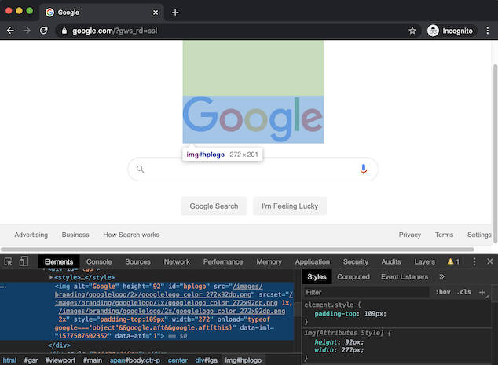

# Introduction

In 2012, the travel site Airbnb removed the ability to sort listings by price. Users could still filter down to a price range, but could no longer view the cheapest listings first. Many users complained on online message boards that the change seemed hostile to users. "It's so frustrating!..What is the logic behind not having this function?" says one user on the [Airbnb support forum](https://community.withairbnb.com/t5/Hosting/Sorting-listing-by-price/td-p/559404). Alas, the feature remains missing to this day.

This is a familiar situation in a world of web applications that are frequently updated without user consent. When web software doesn't quite meet users' needs, their only recourse is to complain to the developers and hope someone listens. Sometimes there is a way to use a browser extension or user script to fix the issue, but making an extension requires sophisticated programming skills. We see this as a waste of the openness of the Web platform, and of the pliability of software in general. If users could make tweaks to web applications without programming, a vast number of people would gain the agency to modify software to meet their unique preferences.

In this paper, we introduce a system called Wildcard^[Wildcard was the original internal name for Hypercard, which pioneered both user modifiable software and the modern Web.] that aims to meet this need. Wildcard adds a panel to the bottom of a web page that shows a structured table view of some of the main data in the page. The table maintains a bidirectional connection to the original page—when the user manipulates the table, the original page also gets modified, and vice versa.

In Wildcard, sorting Airbnb listings by price takes just one click on a table header, with no programming required by the end user. Beyond sorting and filtering data, Wildcard also supports a variety of other use cases like accessing third party APIs, performing small computations, recording private user annotations, and using alternate UI widgets. While Wildcard does not support all changes someone might want to make to a website, the goal of the project is to make a broad subset of changes easily accessible to end users.

Under the hood, there is no magic—Wildcard currently requires a programmer to manually define an adapter between the original page and the data table using web scraping techniques. While programming is required for part of the process, this forms a useful collaboration between the programmer and the end user, since the end user is able to perform many different modifications once an adapter is defined. We also plan to eventually reduce the burden of making adapters (discussed in more detail later).

# Demo: Booking a trip with Wildcard

To get a sense of the user experience of Wildcard, let's see an example of how an end user can modify a website with Wildcard in practice.

For example, here we open up a table view that corresponds to search results on the Airbnb travel site.

<video width="100%" src="media/opentable.mp4" autoplay loop muted playsinline controls class>
</video>

For example, in @Fig:table we open up a table view that corresponds to search results on the Airbnb travel site.

{#fig:table}

* Sorting search results:
  * Airbnb took away search
  * once you see the tabular view, there's an obvious interaction available to anyone familiar with tables
* Injecting new data into the page
  * Take own custom notes, saved in the browser. Maybe shared in the future
* Formulas
  * Compute values to inject into the page
  * TBD: styling
* Using a custom date picker

# System Implementation

_Goal of this section: briefly explain the current implementation. Enough detail to ground further discussion, but don't dwell on it. It's not the main point, and will evolve a lot._

* Built as a Greasemonkey script for now (_todo: convert to a full broser extension?_)
* Describe the adapter API
	* programmer creates adapters for now
	* maybe end users can create in the future, or automated
	* show a snippet of adapter code
* Mention the technique of scraping data from AJAX requests
* future implementation goals
	* make it easy for programmers to add adapters + plugins, and distribute them to users. (Currently all adapters + plugins are part of the main Wildcard codebase)

# Design principles

Below are some of the ideas behind the design of Wildcard. We hope that these principles are also useful for thinking more broadly about enabling end users to modify software. 

## Expose unified structure across applications

_Todo: add a diagram here?_

In *Changing Minds* [@disessa2000], Andrea diSessa critiques the design of modern software with a story about a hypothetical "nightmare bike." Each gear on the nightmare bike is labeled not with a number, but with an icon describing its intended use: smooth pavement uphill, smooth pavement downhill, gravel, etc. By some logic, this is more "user-friendly" than numbered gears, but in fact, hiding orderly structure from the user makes it more difficult to operate the bike. Many modern software designs fall into this trap, teaching users to use isolated modes rather than coherent structure, and the problem gets far worse when operating across multiple applications. Unlike the UNIX philosophy of small tools interoperating through shared abstractions, in modern computing each application is in its own silo of data and functionality.

Wildcard helps people understand and modify the behavior of applications through the lens of a consistent abstraction: a data table. This abstraction strikes a balance between being both simple and generic. A data table is simpler than the DOM tree that describes the details of the UI, but is also generic enough to describe the essence of many different kinds of applications.

Exposing a unified higher-level abstraction is a deliberate choice, and is not the only way to enable users to program without directly using the DOM. Chickenfoot [@bolin2005] and CoScripter [@leshed2008] allow users to create scripts that resemble natural language and "sloppily" match queries to elements in the DOM. These designs allow for a wide range of operations, but don't explicitly indicate what operations are possible—the user must look at the original page and imagine the possibilities. In contrast, Wildcard provides affordances that clearly suggest the availability of certain types of modifications. In addition to giving users more certainty about whether a modification is possible, these affordances might give users new ideas for things to try. Because people are not used to modifying web applications, providing inspiration is an important goal. (Todo: Perhaps something to cite here, re: discoverability in GUIs vs CLIs?)

## Direct manipulation by proxy

In Wildcard, users manipulate a data table added to the page, rather than the original page. Although the interaction with the table is direct like using a spreadsheet, the interaction with the page is indirectly mediated through the table.

We considered other approaches where the user would interact more directly with the original UI, e.g. injecting sort controls into the page, but decided that the consistency and affordances of the table view outweighed the potential confusion of a new layer of indirection.

Making this design successful requires maintaining a close mapping in the user's mind between the new representation and the original page (cite Norman? Cognitive Dimensions?). Wildcard provides live visual cues as the user navigates the data table, similar to the highlighting provided by browser developer tools to indicate the mapping between HTML and the original page.

{#fig:devtools}

## Decouple UI from data

Most software does not provide much user choice for interface elements, even for common data types: e.g., the website provides a datepicker widget, and you have no ability to provide your own replacement datepicker. This forces users to learn many different interfaces for similar tasks, some of them worse than others. It also prevents combining data across multiple applications within a single user interface.

Wildcard exposes the data underlying an application's UI, allowing the user to use interfaces of their choice to view and modify the data. The Expedia datepicker demo above showed one example of how this can be useful, but we also envision creating other widgets for visualizing and editing data. Some examples would be showing geographic data in a custom map that includes the user's own annotations, or editing a blog post in a rich text editor of the user's choice.

One benefit of decoupling data from interfaces is improved UI quality. When UI widgets can compete on their merits rather than based on network effects from the data they have access to, it creates much stronger competition at the interface level. For example, there is competition among email clients (which consume an open protocol), but not among Facebook or Twitter clients. This benefit relates to the SOLID project led by Tim Berners-Lee [@berners-lee2018], which envisions user-controlled data as a mechanism for decoupling data from interfaces, e.g. giving users a choice of which client to use to consume a given social media feed. Wildcard has overlapping goals with SOLID, but does not require decentralized user control of data—the data can remain on a centralized server, as long as the interface can be tweaked by end users. _Note: maybe this paragraph belongs in related work?_

There is also value in using the same consistent interface across many applications. For example, many programmers become deeply familiar with one text editor and use it for many different kinds of tasks. This usage even extends beyond editing permanent files; shell programs can use the user's preferred text editor as an interactive input mechanism (e.g. for editing git commit messages). This ability to generically reuse the text editor in many contexts makes it more worthwhile to invest time mastering the tool. Beaudouin-Lafon and Mackay refer to this type of reuse as _polymorphism_ in interaction  [@beaudouin-lafon2000], noting that it is a key technique for keeping interfaces simple while increasing their power.

_Note: Maybe could relate this section to Concept Reuse?_

_Note: Does this section overlap with "expose unified structure"?_

## In-place toolchain

----------------------      ------------------         -----------------
                            **In-place**               **Not in-place**
**End user friendly**       Wildcard                   IFTTT
**For developers**          browser dev tools          editing OSS
----------------------      -----------------          -----------------

We believe that people are more motivated to modify software when the tools for modification are close at hand while using the original software, referred to by Ink and Switch as an "in-place toolchain" [@inkandswitch2019]. 

Browser developer tools exemplify an in-place toolchain, since they are built in to browsers and available in the context of viewing a page; in contrast, creating a browser extension requires moving out of the browser to a separate development environment.

Wildcard creates an in-place toolchain for modifying web applications. Once installed, if an adapter is available for a  site, it can be immediately modified from within the browser.  Hopefully, this can help make switching from using to modifying software into a smooth transition, rather than a chasm to cross.

## First party cooperation optional

The Web is an unusually extensible platform. On many other platforms (e.g. smartphone operating systems), software is locked down unless first-party developers explicitly provide hooks for plugins and interoperability, but on the Web, all client-side code is available for browser extensions to modify. Application authors can use practices that make it easier to modify their apps (e.g. clean semantic markup), or more difficult (e.g. code obfuscation), but the default state is openness. This gives extensions freedom to modify applications in creative ways that the original developers did not plan for.

Wildcard takes advantage of this openness, and does not depend on cooperation from first-party website developers. Any programmer can add support for any website to Wildcard by building a third party adapter. This design acknowledges the pragmatic reality that most sites today will not have Wildcard support built in, and more broadly do not prioritize client side extensibility.

However, we also hope that first party website developers eventually build in Wildcard support to their applications, which would reduce the burden of maintaining adapters and make Wildcard plugins more stable. While this might seem optimistic, implementing the Wildcard adapter API could be straightforward in a typical client-side application that already has access to a structured version of the data in the page. There is also precedent for first parties implementing an official client extension API in response to user demand: for several years, Google exposed an extension API in Gmail for Greasemonkey scripts to use. (Since then, third parties have created well-maintained alternatives [@streak; @talwar2019], illustrating the value of sharing even third party adapters.)

# Related work

_Note: a lot of this was already covered above; how to deal with that?_

* Instrumental interaction
* Web automation
* Wrapper induction
* Personal data ownsership / SOLID
* Extension helper libraries, e.g. Gmail.js.

# Future work

* still in early development; note the beta release plan (tentative: target public beta availability at the workshop in March?)
* What are the limits of functionality? What can't it do?
	* Should we extend further? Automation workflows? Triggers?
* Could explore automated wrapper induction, building on prior work
* Usability studies
* Link to sign up for future updates