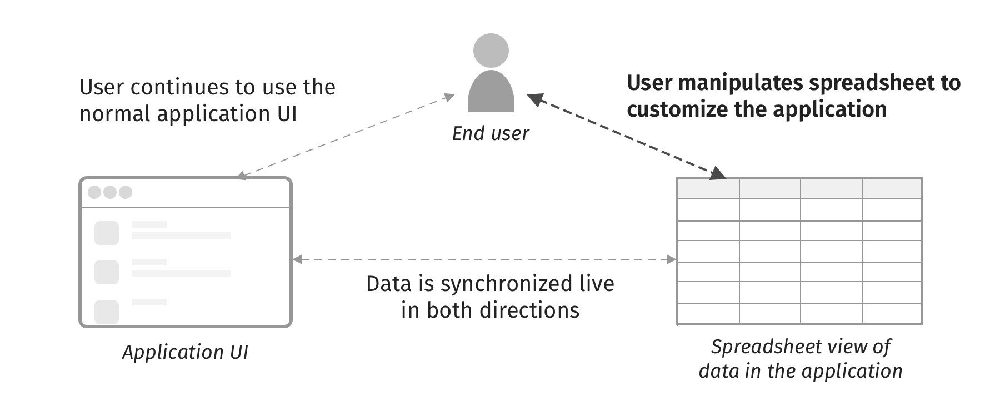
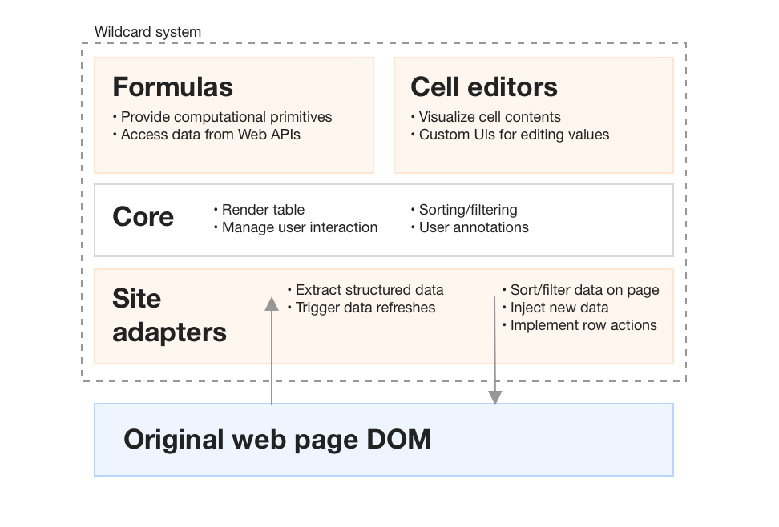

# Introduction {#sec:introduction}

Web applications often don't match the particular needs of their users. Sometimes there is a browser extension available to patch an issue, and if the user is a programmer they might be able to fix it themselves. But for most people, the only recourse is to complain to the developers, or more likely, to simply give up. Back in 1977, in _Personal Dynamic Media_ [@kay1977], Alan Kay envisioned personal computing as a medium that let a user "mold and channel its power to his own needs," but today, software behaves more like concrete than clay.

In this paper, we present _spreadsheet-driven customization_, a technique that enables end users to customize software without doing any traditional programming. The idea is to augment an application’s UI with a spreadsheet that is synchronized with the application’s data. When the user manipulates the spreadsheet, the underlying data is modified and the changes are propagated to the UI, and vice versa.

We have implemented this technique in a prototype browser extension called Wildcard. We've built demos of using Wildcard (shown in [@sec:demos]) which suggest that this paradigm can support useful customizations, ranging from sorting lists of data to adding whole new features to applications.

{#fig:overview}

Our approach requires extracting structured data from the user interfaces of existing applications, but we hide the complexity of data extraction from end users. Programmers write _site adapters_ which use web scraping techniques to extract structured data from existing applications and map them to the spreadsheet table. Our prototype suggests that it is possible to implement site adapters for real websites; [@sec:implementation] describes some of the techniques and challenges involved.

Spreadsheet-driven customization provides an easy entry point for end users, since small tweaks like sorting data can be performed with a single click. At the same time, it also supports a variety of richer customizations, like adding private annotations to a webpage or joining in related data from a web API. In [@sec:design-principles], we elaborate on this breadth of use cases, as well as other design principles guiding our work.

Prior work [@mccutchen2016;@benson2014;@chang2014] has enabled end users to create "spreadsheet-driven applications" which use spreadsheets as a backing data layer. Spreadsheet-driven *customization* applies this idea in a different context: customizing existing software, rather than building new software from scratch. Our technique does not require that the application actually be backed by a spreadsheet; it merely uses the spreadsheet as an interface for viewing and modifying the internal state of the application. In [@sec:related-work], we describe how Wildcard relates to existing work on spreadsheet-driven apps, as well as other areas like web customization and web scraping.

The Wildcard extension is currently an early research prototype. We plan to continue testing the system with our own use cases to explore how the spreadsheet abstraction maps to real websites and customization needs. Eventually we plan to release the tool publicly in order to study real use cases, discover usability challenges, and to test the feasibility of programmers building and maintaining site adapters.

# Demo {#sec:demos}

Here are some examples of using Wildcard to customize websites in useful ways.<span class="pdf-only"> These demos are best viewed as videos in the online version of this paper (\url{https://www.geoffreylitt.com/wildcard}).</span>

<div class="pdf-only">

{#fig:airbnb-demo}

</div>

## Customizing search results

In 2012, the travel site Airbnb removed the ability to sort accommodation searches by price. Users could still filter by price range, but could no longer view the cheapest listings first. Many users complained that the change seemed hostile to users. "It's so frustrating!..What is the logic behind not having this function?" said one user on the [Airbnb support forum](https://community.withairbnb.com/t5/Hosting/Sorting-listing-by-price/td-p/559404). Alas, the feature remains missing to this day.

Using Wildcard, the user can fix this omission, while leaving the page's design and the rest of its functionality unchanged.<span class="pdf-only"> [@fig:airbnb-demo] shows an overview of augmenting the Airbnb site.</span> First, the user opens up the Wildcard panel, which shows a table corresponding to the search results in the page. As they click around in the table, the corresponding row in the page is highlighted so they can see the connection between the views. 

<video controls="controls" preload="auto" muted="muted" src="media/table.mp4#t=0.1" muted playsinline controls class>
</video>

Then, the user clicks on the price column header to sort the spreadsheet and the Airbnb UI by price<span class="pdf-only"> ([@fig:airbnb-demo]B)</span>. They also filter to listings with a user rating above 4.5 (another feature missing in the original Airbnb UI).

<video controls="controls" preload="auto" muted="muted" src="media/sort-filter.mp4#t=0.1" muted playsinline controls class>
</video>

After manipulating the data, the user closes the table view and continues using the website with its original visual design. The table view offers a way to change the data backing a page, but does not need to replace the original interface entirely.

Most websites that show lists of data also offer actions on rows in the table, like adding an item to a shopping cart. Wildcard has the ability to make these "row actions" available in the data table through the site adapter. In the Airbnb UI, saving multiple listings to a Favorites list requires tediously clicking through them one by one. Using Wildcard row actions, the user can select multiple rows and favorite all of them with a single click<span class="pdf-only"> ([@fig:airbnb-demo]D)</span>. Similarly, the user can open the detailed pages for many listings at once.

<video controls="controls" preload="auto" muted="muted" src="media/favorite-open.mp4#t=0.1" muted playsinline controls class>
</video>

Next, the user wants to jot down some notes about each listing. To do this, they type some notes into an additional column in each listing row, and the notes appear inside the listings in the original UI<span class="pdf-only"> ([@fig:airbnb-demo]A)</span>. The annotations are saved in the browser for future sessions. 

<video controls="controls" preload="auto" muted="muted" src="media/annotate.mp4#t=0.1" muted playsinline controls class>
</video>

Wildcard also includes a formula language that enables more sophisticated customizations. When traveling without a car, it's useful to evaluate potential places to stay based on how walkable the surroundings are. Using a formula, the user can integrate Airbnb with Walkscore, an API that rates the walkability of any location on a 1-100 scale. When the user uses the `walkscore` function with the listing's latitude and longitude as inputs, it returns the walk score for that location and shows it as the cell value. Because the cell's contents are injected into the page, the score also appears in the UI<span class="pdf-only"> ([@fig:airbnb-demo]C)</span>.

<video controls="controls" preload="auto" muted="muted" src="media/walkscore.mp4#t=0.1" muted playsinline controls class>
</video>

## Snoozing todos

In addition to fetching data from other sources, Wildcard formulas can also perform computations. In this example, the user wants to augment the TodoMVC todo list app with a "snooze" feature, which will temporarily hide a todo from the list until a certain date.

The user starts by opening the table view, which shows the text and completed status of each todo, and live updates as the list changes. They start the customization by adding a new `snoozeDate` column to store the snooze date for each todo.

<video controls="controls" preload="auto" muted="muted" src="media/todo-date.mp4#t=0.1" muted playsinline controls class>
</video>

The next step is to hide snoozed todos. The user creates a new `snoozed?` column, which uses a formula to compute whether a todo has a snooze date in the future. Then, they simply filter the table to hide the snoozed todos.

<video controls="controls" preload="auto" muted="muted" src="media/todo-snooze-formula.mp4#t=0.1" muted playsinline controls class>
</video>

As time passes, the built-in `NOW()` function will return the current date, and snoozed todos will automatically appear at the right time.

Because this implementation of snoozing was built on top of the spreadsheet abstraction, it is completely decoupled from this particular todo list app. We envision that users could package and share these types of customizations as generic browser extensions, which could then be instantly applied to any site supported by Wildcard.

## Customizing a form input

<div class="pdf-only">

{#fig:expedia-demo}

</div>

It might seem that Wildcard is only useful on websites that display lists of tabular data, but in fact, the table metaphor is flexible enough to represent many types of data. For example, a flight search form on Expedia can be represented as a single row, with a column corresponding to each input. <span class="pdf-only"> [@fig:expedia-demo] shows an overview of augmenting the Expedia site.</span>

<video controls="controls" preload="auto" muted="muted" src="media/expedia-table.mp4#t=0.1" muted playsinline controls class>
</video>

In some of the previous examples, the table cells were read-only (because users can't, for example, change the name or price of an Airbnb listing). In this case, the cells are writable, which means that changes in the table are reflected in the form inputs. This becomes especially useful when combined with GUI widgets that can edit the value of a table cell.

Filling in dates for a flight search often requires a cumbersome workflow: open up a separate calendar app, find the dates for the trip, and then carefully copy them into the form. In Wildcard, the user can avoid this by using a datepicker widget that shows the user's personal calendar events<span class="pdf-only"> ([@fig:expedia-demo]B)</span>. The user can directly click on the correct date, and it gets inserted into both the spreadsheet and the original form.

<video controls="controls" preload="auto" muted="muted" src="media/datepicker.mp4#t=0.1" muted playsinline controls class>
</video>

In this section we’ve presented just a few use cases for spreadsheet-driven customization, to hint at the possibilities of the paradigm. We think the spreadsheet model is flexible enough to support a wide range of other useful modifications, while remaining familiar and easy to use. 

# System Implementation {#sec:implementation}

Wildcard is written in Typescript. It is currently injected into pages using the [Tampermonkey](https://www.tampermonkey.net/) userscript manager, but in the future we plan to deploy it as a standalone browser extension to make it easier to install.

In order to promote extensibility, Wildcard is implemented as a small core program along with several types of plugins: site adapters, formulas, and cell editors. The core contains functionality for displaying the data table and handling user interactions, and the table implementation is built using the [Handsontable](https://handsontable.com/) Javascript library.

{#fig:architecture}

Site adapters are a key part of Wildcard, since they specify the bidirectional connection between the web page and its structured data representation.

Wildcard provides an interface for concisely expressing how the DOM should be mapped to the spreadsheet table. For example, here is a code snippet for extracting the name of an Airbnb listing:

```typescript
{
  // Field metadata:
  fieldName: "name", // The name of the field
  type: "text",      // The type of the field
  readOnly: true,    // Whether the user can edit the field
  
  // Function to extract DOM element:
  el: (row) => row.querySelector(`.${titleClass}`),
}
```

Sometimes sophisticated scraping techniques are necessary to extract the necessary data from the application. For example, when we have prototyped mechanisms for site adapters to observe AJAX requests made by the browser and extract data directly from JSON responses. This mechanism was used to implement the Airbnb Walkscore example, since latitude and longitude aren't shown in the Airbnb UI, but they are available in AJAX responses. This technique seems promising because AJAX responses tend to already contain data in a structured form, and web applications increasingly load data using AJAX. Another technique we might consider adding is the ability for site adapters to scrape data across multiple pages for paginated lists of results (as explored in [@huynh2006]).

The site adapter also needs to support the reverse direction: sending updates from the table to the original page. Most DOM manipulation is not performed directly by the site adapter. Instead, Wildcard automatically mutates the DOM to reflect the spreadsheet state, using the same declarative spec shown above. The only exception is row actions (like favoriting an Airbnb listing), which are implemented as imperative Javascript functions that can can mutate the DOM, simulate clicks on buttons, etc.

# Design Principles {#sec:design-principles}

The idea of spreadsheet-driven customization is guided by several design principles, inspired by prior work and our own experimentation. We think these principles can also broadly inform the design of tools for end user software customization.

## Expose a universal data structure

Today, most personal computing consists of using applications, which bundle together behavior and data to provide some set of functionality. While there are some limited points of interoperability, applications generally are designed to operate independently of one another.

Computing does not need to be organized this way. For example, UNIX offers a compelling alternative design: many small single-purpose utilities, all of which manipulate a universal format of text streams. The universal format creates a high degree of leverage from tools: users can get a lot of utility from deeply mastering a text editor and text manipulation utilities like `cut` and `sed`, because these tools can be applied to a huge variety of tasks. A user's preferred text editor can even serve as an interactive input mechanism in shell programs, e.g. for editing git commit messages.

Spreadsheet-driven customization aims to bring some of the UNIX ethos to the world of isolated Web applications, by creating a consistent data structure to represent the data inside many applications. In UNIX, the universal format is a text stream; in Wildcard, it is a relational table. Because Wildcard maps the data from all applications to the table format, users can invest in mastering the Wildcard table editor, the formula language, and cell editor UIs, and reuse those same tools to customize many different applications.

This idea relates to Beaudouin-Lafon and Mackay's notion of _polymorphic interface instruments_ [@beaudouin-lafon2000], which are UI elements that can be used in different contexts (for example, a color picker that can be used in many different drawing applications). It also relates to ideas of literacy in a medium. diSessa notes that textual literacy rests on the fact that writing can be adapted to many different genres and uses [@disessa2000]; if people needed to relearn reading and writing from scratch when switching from essays to emails, the medium would lose most of its potency. Having generic tools is especially important for software customization, because the most common barrier to customizing software is not having enough time [@mackay1991]. It's more likely that people will customize software regularly if they can reuse the same tools across many applications.

This design principle leads to several challenges. First, any universal abstraction has its constraints, and can't necessarily naturally express the data in every application. We plan to explore the limits of the table abstraction further, by trying to build adapters for more sites with varied data formats. We expect that many types of data can fit easily into tables: lists of search results, news articles, and messages can all naturally be seen as relations. For sites that use document structures (e.g. Google Docs) or graph structures (e.g. social networks), it may prove more challenging to map internal data to the table abstraction.

## Low floor, high ceiling

Seymour Papert advocated for programming systems to have a "low floor," making it easy for novices to get started, and a "high ceiling," providing a large range of possibilities for more sophisticated users [@resnick2016]. Our goal is for spreadsheet-driven customization to meet both of these criteria.

One of the most interesting properties of spreadsheets is that users who are only know a tiny sliver of their functionality (e.g., storing tables of numbers or computing simple sums) can still use them in genuinely valuable ways. The fact that useful tasks can be performed early on supports the user's natural motivation to continue using the tool, and to eventually learn its more powerful features if needed [@nardi1991]. In contrast, many traditional programming systems require an enormous upfront time investment before someone is able to write a program that helps them achieve a useful task in their life.

As part of ensuring a low floor, we have focused on including genuinely valuable features for novices. For example, a user can sort a table with a single click, or simply type in some annotations. We would expect many Wildcard users to start by using these simpler features before potentially moving on to more sophisticated features like formulas.

Another aspect of providing a low floor is providing an "in-place toolchain" [@inkandswitch2019]: minimizing the effort of moving from using to customizing, by making customization tools available in the same environment where the user is already using the software. This quality is distinct from the level of technical skill needed to use the tool. For example, setting up a workflow trigger in an end user programming system like [IFTTT](https://ifttt.com/) does not require much technical skill, but does require leaving the user's normal software and entering a separate environment; conversely, running a Javascript snippet in the browser console requires programming skills, but can be done immediately and casually in the flow of using a website.


------------------------      ------------------         ----------------------------------------
                              *In-place*                   *Not in-place*
*End user friendly*           **Wildcard**               IFTTT
*Requires programming*        browser JS console          using Web APIs in Python
------------------------      -----------------          ----------------------------------------

Wildcard provides an in-place toolchain because the spreadsheet can be instantly opened in the browser window while using any supported website. Once the user starts editing, Wildcard also provides live feedback, so that even if a user isn't yet totally familiar with Wildcard, they can learn to use the system through experimentation.

Since we have still only built several site adapters and demos, it is still too early to tell exactly how high the ceiling is for the customizations that can be achieved with Wildcard. But we think that with enough operators, the formula language could support a wide variety of customizations—people have managed to use simple spreadsheet formula languages to solve a surprisingly large range of problems. We plan to explore this aspect further by trying to solve more real problems with the system and observing where limitations emerge in practice.

## Build for multiple tiers of users

Real-world spreadsheet usage is highly collaborative. Many users just perform simple changes, while their coworkers help with writing more complex formulas or even programming macros [@nardi1990]. Inspired by this, we aim to make spreadsheet-driven customization a collaborative activity that combines the different abilities of different users.

The main way we do this is by separating website customization into two separate stages: structured data extraction, performed by programmers who code site adapters in Javascript, and then customization using the resulting spreadsheet, which is available to all end users. This architecture frees end users from needing to think about data extraction, and enables a community of end users to reuse the efforts of programmers building site adapters.

The group of users building adapters does not necessarily need to be limited only to programmers. In the future, we plan to explore enabling end users to also create site adapters, drawing on related work in this area [@chasins2018; @huynh2006]. But even then, we still envision a separation between highly motivated, tech-savvy end users building adapters, and more casual end users just using the spreadsheet view.

Another group to consider is the first party developers of the original software. Spreadsheet-driven customization does not depend on cooperation from first-party website developers, but if they were to expose structured data in their web application clients, it would eliminate the need for third party site adapters. We think there are compelling reasons for first parties to consider doing this. Providing Wildcard support would allow users to build extensions to fulfill their own feature requests. It also would not necessarily require much effort, since adding Wildcard support could be fairly straightforward for a first-party that already has direct access to the structured data in the page. There is also precedent for first parties implementing an official client extension API: for several years, Google maintained an official extension API in Gmail for Greasemonkey scripts to use. ^[Incidentally, since then, third parties have continued to maintain stable Gmail extension APIs used by many browser extensions [@streak; @talwar2019], illustrating the potential of collaboratively maintaining third party adapters.]

# Related Work {#sec:related-work}

## Malleable software

In the broadest sense, Wildcard is inspired by systems aiming to make software into a dynamic medium where end users frequently create and modify software to meet their own needs, rather than only consuming applications built by programmers. These systems include Smalltalk [@kay1977], Hypercard [@hypercard2019] , Boxer [@disessa1986], Webstrates [@klokmose2015], and Dynamicland [@victor]. ^[The project's name Wildcard comes from the internal pre-release name for Hypercard, which doubly inspired our work by promoting both software modification by end users and the ideas behind the Web.]

While similar in broad goals, Wildcard employs a different solution strategy. These projects generally require building software from scratch in a new environment, whereas Wildcard aims to maximize the malleability of software built with existing tools.

With substantial future work, we think Wildcard could become more similar to these other projects, growing from a platform for tweaking existing software into a platform for building new software from scratch. This would likely end up resembling existing tools for building spreadsheet-driven applications (discussed more below), but with an additional focus on customization by end users of the software.

## Web customization

Wildcard's goals are closely shared with other systems that provide interfaces in the browser for end users to customize websites.

### Structured augmentation

Wildcard's solution approach is most similar to other tools that identify structured data in a web page, and then use that structure to support end user customization of the page.

Sifter [@huynh2006] enables users to sort and filter lists of data on web pages, which resembles Wildcard's sorting functionality. The underlying mechanism is similar, since Sifter extracts structured data from the page to enable its user-facing functionality. However, the systems also have significant differences:

* Wildcard supports a broad set of customizations, but Sifter only supports sorting and filtering.
* Wildcard shows the structured data table directly to the user. Sifter only shows sorting controls, and does not reveal the underlying data table.
* Wildcard hides data extraction from end users. Sifter uses a combination of automated heuristics and interactive user feedback to involve end users in extracting data.

Thresher [@hogue2005] enables users to create wrappers which map unstructured website content to Semantic Web content. Like Wildcard and Sifter, Thresher augments the page; once semantic content has been identified, it creates context menus in the original website which allow users to take actions based on that content. Wildcard and Thresher focus on complementary parts of the customization process. Thresher aims to enable end users to create content wrappers, but the actions available on the structured data are determined in advance. Conversely, Wildcard delegates wrapper creation to programmers, but gives end users more flexibility to use the structured data in an open-ended way.

### Sloppy augmentation

"Sloppy programming" [@little2010] tools like Chickenfoot [@bolin2005] and Coscripter [@leshed2008] enable users to create web automation scripts without directly interacting with the DOM. The scripts can perform actions like filling in text boxes and clicking on buttons. Users express the desired page elements in natural, informal terms (e.g. writing "the username box" to represent the textbox closest to the label "username"), and then the system uses a set of heuristics to determine which elements most likely match the user's intent. This approach allows for expressing a wide variety of commands with minimal training, but it also has downsides [@little2010]:

* *Reliability*: It can be difficult to know whether a command will consistently work over time. In addition to changes to the website, changes to the heuristics can also cause problems.
* *Discoverability*: it can be difficult for users to discover the space of possible commands.

Wildcard offers a sharp contrast to sloppy programming, instead choosing to expose a high degree of structure through the familiar spreadsheet table. Wildcard offers more consistency; for example, clicking a sort header will always work correctly as long as the site adapter is maintained. Wildcard also offers clearer affordances for what types of actions are possible, or, crucially, what actions are _not_ possible, which is useful to know. On the other hand, Wildcard's explicit site adapter approach means that fewer websites can be customized, and also that users can't perform customizations if the relevant data is not in the spreadsheet.

## Spreadsheet-based app builders

Many others have had the powerful realization that a spreadsheet can serve as an backing data store and computation layer for an interactive web application, enabling end users to create such applications more easily. Research projects like Object Spreadsheets [@mccutchen2016], Quilt [@benson2014], Gneiss [@chang2014], and Marmite [@wong2007], as well as commercial tools like Airtable [@zotero-79] and Glide [@zotero-81] allow users to view data in a spreadsheet table, compute over the data using formulas, and then connect the table to a GUI. Because many users are already familiar with using spreadsheets, this way of creating applications tends to be much easier than traditional software methods; for example, in a user study of Quilt, many users were able to create applications in under 10 minutes, even if they expected it would take them many hours. 

Wildcard builds on this idea, but applies it to modifying existing applications, rather than building new applications from scratch. For many people, we suspect that tweaking existing applications provides more motivation as a starting point for programming than creating a new application from scratch.

An important design decision for tools in this space is how to deviate from traditional spreadsheets like Microsoft Excel or Google Sheets. Quilt and Glide use existing spreadsheet software as a backend, providing maximum familiarity for users, and even compatibility with existing spreadsheets. Gneiss has its own spreadsheet implementation with additional features useful for building GUIs. Marmite provides a live data view that resembles a spreadsheet, but programming is actually done using a separate data flow pane rather than spreadsheet formulas. (Marmite's approach led to some confusion in a user study, because users expected behavior more similar to spreadsheets [@wong2007].) Airtable deviates the furthest: although the user interface resembles a spreadsheet, the underlying structure is a relational database with typed columns. Wildcard's table is most similar to Airtable; the structure of a relational table is most appropriate for most data in websites, and we have not yet found a need for arbitrary untyped cells.

## Web scraping / data extraction

Web scraping tools focus on extracting structured data out of unstructured web pages. Web scraping is closely related to the implementation of Wildcard, but has different end goals: web scraping generally extracts static data for processing in another environment, whereas Wildcard customizes the application's UI by maintaining a bidirectional connection between the extracted data and the page.

Web scraping tools differ in how much structure they attempt to map onto the data. Some tools like Rousillon [@chasins2018] extract data in a minimally structured relational format; other tools like Piggy Bank [@huynh2005] more ambitiously map the data to a rich semantic schema. In Wildcard, we chose to avoid semantic schemas, in order to minimize the work associated with creating a site adapter.

In the future, we might try to integrate existing web scraping tools, to help create more reliable site adapters for Wildcard with less work, and to open up adapter creation to end users. 

# Future Work

There are still many open questions about spreadsheet-driven customization which we hope to answer through targeted development and usage of the Wildcard prototype.

The most important question is: what are the limits of this computational model? What types of useful customizations can it support or not support? While initial demos suggest a variety of use cases, we plan to develop more site adapters and demos to explore this question further. We will start with privately testing the system with our own needs, and then eventually deploy the tool publicly, once the API is stable enough and can support a critical mass of sites and use cases. We also plan to run usability studies to evaluate and improve the design of the tool.

We suspect that two areas of the current model may prove limiting. First, Wildcard's data model currently shows a single table at a time, without any notion of relationships between tables. A richer data model with foreign keys might help support certain use cases. For designing a spreadsheet interface on top of a richer relational model, we could learn from other systems with this design [@mccutchen2016; @bakke2016].

A second limitation is that there is currently no way for end users to express imperative workflows with sequences of actions. Related work has shown these types of workflows to be useful [@bolin2005;@leshed2008] in practice. It's not clear how such workflows could fit into Wildcard, since spreadsheets have a fundamentally different computation model, and site adapters created by programmers cannot easily account for every possible action a user would want to take in a page.

Another open question is how easily site adapters can be created and maintained for real websites, which often include complex markup and change frequently. We plan to explore this question by creating adapters for sites with different data structures and in different domains, and perhaps running user tests with programmers. Possible future improvements we've considered include developing automated heuristics to assist with the adapter creation process, and developing new abstractions that make it easier for programmers to efficiently create new robust adapters.

# Conclusion

In this paper, we have presented _spreadsheet-driven customization_, a technique that enables end users to customize software by augmenting an application’s UI with a spreadsheet. We hope that this technique contributes to making the Web into a more dynamic medium that users can mold to their own needs.

We plan to continue developing the Wildcard prototype and to eventually deploy it as an open-source tool. To receive future updates on Wildcard and notifications about a public release, [sign up for the email newsletter]().

We are also looking for private beta testers. If you have an idea for how you might want to use Wildcard, please [get in touch](mailto:glitt@mit.edu). We would love to hear about your needs and help find ways to use Wildcard to solve them.

<div class="html-only">
Thanks to Glen Chiacchieri, David Karger, Steve Krouse, Rob Miller, Arvind Satyanarayan, Daniel Windham, and Maggie Yellen for providing valuable feedback on this work.
</div>