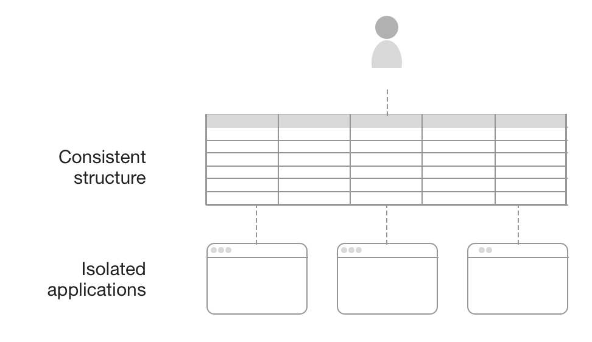
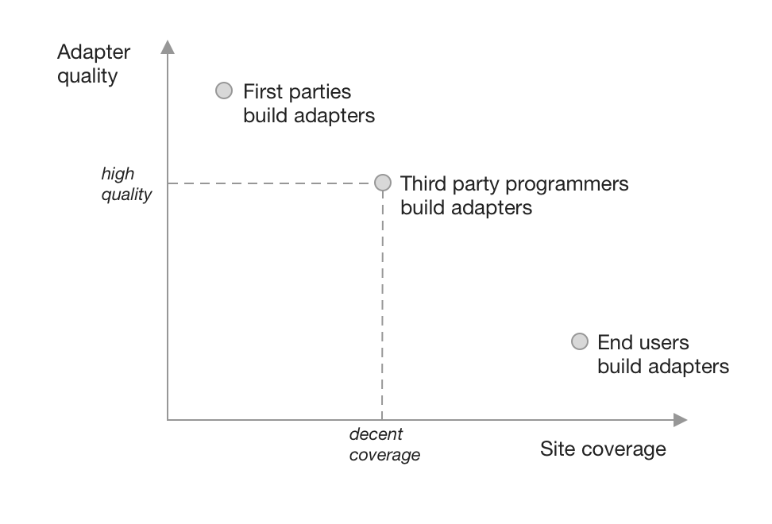

# Introduction

In 2012, the travel site Airbnb removed the ability to sort listings by price. Users could still filter by price range, but could no longer view the cheapest listings first. Many users complained on online message boards that the change seemed hostile to users. "It's so frustrating!..What is the logic behind not having this function?" said one user on the [Airbnb support forum](https://community.withairbnb.com/t5/Hosting/Sorting-listing-by-price/td-p/559404). Alas, the feature remains missing to this day.

This is a familiar situation in a world of web applications that are frequently updated without user consent. Sometimes there is a browser extension or user script that fixes an issue, and if the user is both motivated and skilled they might even be able to implement their own fix. But for most people in most situations, the only recourse is to complain to the developers and pray that someone listens—or more likely, to simply give up. While many have become used to this status quo, we see it as a tremendous waste of the openness of the Web platform. Back in 1977, in _Personal Dynamic Media_ [@kay1977], Alan Kay had originally envisioned personal computing as a medium that let a user "mold and channel its power to his own needs," but today's software is more like concrete than clay.

In this paper, we introduce Wildcard, an extension framework embedded in the browser that lets users tweak web applications without programming in Javascript or interacting with the DOM. Wildcard shows a structured table view of the main data in a webpage, which maintains a live bidirectional connection to the original UI: when the user manipulates the table, the UI  is instantly modified, and vice versa. This simple framework allows a wide range of possible modifications, ranging from sorting lists to fetching related data from other websites.

The system builds on two insights from prior work. The first insight is that a spreadsheet can serve as the backend for a GUI application, which enables an end user to build applications in an extremely accessible environment without doing traditional programming. The second insight is that web scraping—extracting structured data from an unstructured web page—unlocks value by making it possible to compute over that data. Our contribution in this work is to combine those two ideas in a novel way. By extracting structured data from an application and showing that data in a live spreadsheet table, Wildcard enables a wide class of end user modifications to existing applications. Wildcard makes it seem like an application is backed by a spreadsheet, even though the actual implementation is not. This allows the user to easily manipulate and compute over the application's underlying data just as they would in a spreadsheet, and then to immediately see the results of their changes in the original application's UI.

Wildcard embodies several principles we propose for designing systems that enable end user modification of existing software:

_Expose consistent structure_: Most applications only expose a user interface, without showing the structure of the data underneath. Furthermore, every application has a different interface, requiring users to learn many ways of using apps. Wildcard shows data from diverse applications in a single consistent structure, so that users are able to invest in learning one mechanism for manipulating the data in their applications, and for programming with that data. 

_Low floor, high ceiling_: We aim to provide a low barrier to entry so that non-programmers can casually use the system, but a high ceiling on the complexity it can achieve. Small but genuinely valuable tweaks like sorting a page are made possible with little effort in the flow of normal use to provide a low floor, and a rich formula system creates a high ceiling on possible modifications. 

_Build for multiple tiers of users_: We aim to make Wildcard as easy as possible for end users, by designing roles for tiers of users with differing levels of technical sophistication. Programmers or tech-savvy end users are responsible for the data extraction step of mapping existing UIs to structured data. Most end users only interact with the structured data, providing a predictable and user-friendly experience.

Wildcard is currently an early research prototype, with incomplete features and limited coverage of sites. We plan to continue privately testing the system with our own use cases, and then to release the tool publicly, enabling other programmers to contribute site adapters and other plugins. Ultimately, we hope that Wildcard makes modifying websites into a natural part of using the web, as ubiquitous as using spreadsheets in everyday computing.

# Demos

To get a sense of how it feels to use Wildcard, let's see an example of using it to help with booking a trip using the travel sites Airbnb and Expedia.

## Sorting and filtering

We start by opening up the Airbnb search listings page to look for a place to stay. As mentioned before, this page doesn't let us sort by price, but we can use Wildcard to fix that. First, we open up the Wildcard panel, which shows a table corresponding to the search results in the page. As we click around in the table, the corresponding row in the page is highlighted so we can see the connection between the views. 

<video width="100%" controls="controls" preload="auto" muted="muted" src="media/table.mp4#t=0.1" muted playsinline controls class>
</video>

When we click the Price column header in the table, both the table and the original page become sorted by price. We can also filter listings by rating, another feature not offered in the Airbnb site.

<video width="100%" controls="controls" preload="auto" muted="muted" src="media/sort-filter.mp4#t=0.1" muted playsinline controls class>
</video>

After finishing the sorting and filtering, we can close the table view and continue using the website in its original polished design.

## Row actions

Most websites that show lists of data also offer actions that can be taken on a row in the table, like adding an item to a shopping cart. Wildcard has the ability to make these actions available in the data table if the site adapter implements them. The main advantage this provides is the ability to easily perform an action in bulk across multiple rows.

For example, it's tedious on Airbnb to click on listings one by one to add them to a list of favorites. Using Wildcard, we can just select multiple rows and favorite all of them with one click. Similarly, we can also open the detailed pages for many listings in new tabs.

<video width="100%" controls="controls" preload="auto" muted="muted" src="media/favorite-open.mp4#t=0.1" muted playsinline controls class>
</video>

Within the site adapter, each action is implemented as a regular Javascript function running in the context of the page. It can simulate clicks on buttons in the UI, launch AJAX requests, navigate to new pages, etc.

## User annotations

It's a common practice in spreadsheets to add a column next to a table for recording notes about the item in each row. In Wildcard, this pattern can be used to create private annotations in a website. Here, we use this feature to jot down pros and cons of various listings:

<video width="100%" controls="controls" preload="auto" muted="muted" src="media/annotate.mp4#t=0.1" muted playsinline controls class>
</video>

_drop the implementation part?_

In order to match the annotations with the existing design, the site adapter specifies a reasonable location in each row for injecting new data.

Annotations are persisted in browser local storage so the user can come back and view them later. The site adapter associates each table row with a stable identifier from the original site so that annotations can be displayed with the appropriate item.

Currently annotations are private to the browser of the user that created them, but it could be useful in the future to allow users to share annotations. 

## Computation with formulas

The demos so far have shown straightforward tweaks that provide useful conveniences with little effort. But Wildcard also supports more sophisticated tweaks that fetch external data and perform computations, using a formula language.

When traveling without a car, it's nice to evaluate potential places to stay based on how walkable the surroundings. Using Wildcard formulas, we can integrate Airbnb with Walkscore, an API that can rate the walkability of any location on a 1-100 scale. When we call the `WALKSCORE` formula with the latitude and longitude of the listing, it returns the score as the cell value. Because the cell is shown in the page, the score also shows up in the page body.

<video width="100%" controls="controls" preload="auto" muted="muted" src="media/walkscore.mp4#t=0.1" muted playsinline controls class>
</video>

Wildcard formulas are just Javascript functions that take table data as input and return new data. Formulas can have limited side effects like accessing external APIs to fetch data, but do not directly manipulate the page. Instead, they return data into the table, which is then injected into the page with the same mechanism used for injecting user annotations.

## Custom UI elements

It might seem that Wildcard is only useful on websites that display lists of tabular data like search results. But in fact, the table metaphor is flexible enough to represent many types of data. For example, a form can be represented as a single row, with a column for each input.

<video width="100%" controls="controls" preload="auto" muted="muted" src="media/expedia-table.mp4#t=0.1" muted playsinline controls class>
</video>

In previous examples the data extracted from the site was marked as read-only; one cannot change the name of an Airbnb listing for example. In the next case, the cells are marked as writable, so that changes in the table are reflected in the original form. This becomes particularly useful when combined with cell editing UI widgets tailored to the cell's data type.

Filling in dates for a flight search typically requires opening up a separate calendar app to find the right dates, and then manually copying them into the form. In Wildcard, we can make this easier by providing a datepicker widget that has privileged access to the user's calendar information.

<video width="100%" controls="controls" preload="auto" muted="muted" src="media/datepicker.mp4#t=0.1" muted playsinline controls class>
</video>

Custom UIs enable people to use a consistent UI to enter common types of data across the web.  They also allow a user to access their own private data as part of a web interface, without needing to expose it to the website server.

Overall, the interactive data table offers a computational model that presents a surprisingly large range of useful possibilities for end user modification of websites, while also remaining familiar and easy to use. Here we’ve presented just a few of these possibilities.

# System Architecture

Wildcard is written in Typescript. It is currently injected into pages using the [Tampermonkey](https://www.tampermonkey.net/) userscript manager, but in the future we plan to deploy it as a standalone browser extension to make it easier to install.

In order to maximize extensibility, Wildcard is implemented as a small core program along with several types of plugins: site adapters, formulas, and cell renderers/editors. The core contains functionality for displaying the data table and handling user interactions, and the table implementation is built using the [Handsontable](https://handsontable.com/) Javascript library.


Site adapters specify the bidirectional connection between the web page and its structured data representation.

For extracting data from the page and getting it into structured form, Wildcard provides ways to concisely and declaratively express scraping logic. For example, here is a code snippet for extracting the name of an Airbnb listing. It specifies the field name and some metadata properties, and then a function that, given the entire listing, returns the DOM element representing the name of the listing.

```typescript
  {
    fieldName: "name",
    readOnly: true,
    type: "text",
    el: (row) => row.querySelector(`.${titleClass}`),
  }
```

The site adapter also needs to support the reverse direction: sending updates from the table to the original page. Most DOM manipulation is not performed directly by the site adapter: the adapter specifies how to find the divs representing data rows, and the core platform mutates the DOM to reflect the table state. The only exception is site-specific actions (like favoriting in Airbnb) which runs Javascript code that can mutate the DOM or perform other arbitrary behaviors.

# Design principles

The design of Wildcard is grounded in several principles, informed by prior work and our own experimentation. We think these principles extend beyond Wildcard itself and might inform the design of other end user programming tools, particularly systems enabling users to modify GUI apps.

## Expose consistent structure

Today, most personal computing consists of using distinct apps, each one an isolated silo of concepts, interfaces, data, and functionality. While there are some shared idioms and limited points of interoperability, the fundamental expectation is that each app operates independently. If a new need emerges, a user must hope "there's an app for that"; creating a new tool to meet the need is often out of the question.

Computing does not need to operate this way. As one example, UNIX offers a compelling alternate vision of small tools connected through a common abstraction of text files. Just like riding a bike with numbered gears, UNIX requires users to build up a structured understanding of the system, which then allows them to flexibly react to new needs not served by existing tools. Users can also deeply master a text editor and use it for a vast array of tasks, even as an interactive input mechanism in shell programs (e.g. for editing git commit messages). Beaudouin-Lafon and Mackay call this style of interaction _polymorphic_ [@beaudouin-lafon2000], since a single interface can be used in many contexts. diSessa  [@disessa2000] notes the deep connection between polymorphism and literacy: textual literacy rests on a single rich medium of writing, which once mastered, can be adapted to many different genres and uses. If people needed to relearn from scratch when switching from writing essays to writing emails, the medium would lose most of its potency; this is the situation in software today.

With Wildcard, we hope to make isolated Web applications work a little bit more like UNIX, by imposing a consistent and simple structure onto many isolated applications. Just as UNIX uses text files to represent all data, Wildcard uses relational tables. This abstraction strikes a balance between being simple and generic: a data table is much simpler than the DOM tree that describes all the details of the UI, but is also generic enough to describe the essence of many different interfaces.



Exposing more structured data to users provides improved quality and consistency of user interfaces. When UI widgets can compete on their merits rather than having a monopoly on a given data silo or application, it creates stronger competition at the interface level. For example, there is competition among email clients which consume an open protocol, but not among Facebook or Twitter clients. Exposing structure also leads to improved UI consistency across apps: UNIX users can reuse their text editor everywhere, but Web users must use a different rich text editor for each site. Tim Berners-Lee has written in more detail about these benefits [@berners-lee2018] in the context of the SOLID project, which envisions user-controlled data as a mechanism for decoupling data from interfaces, e.g. giving users a choice of which client to use to consume a given social media feed. Wildcard has overlapping goals with SOLID, but does not require decentralized user control of data—the data can remain on a centralized server, as long as the interface can be tweaked by end users.

Layering a structured view on top of an existing application is not the only option available. "Sloppy programming" systems like Chickenfoot [@bolin2005] and CoScripter [@leshed2008] forego the intermediate layer of structure, instead allowing users to create scripts in an informal language and then perform fuzzy pattern matching to find elements in the DOM. For example, to find a button after a textbox in Chickenfoot, the user could type `click(find(“button just after textbox”))`. These designs allow for expressing a wide range of operations, but they don't explicitly indicate what operations are possible—the user can only see the original page and imagine the possibilities. In contrast, Wildcard provides affordances that clearly suggest the availability of certain actions (e.g. sorting, editing a cell, adding a column with a derived value), especially to users who are familiar with spreadsheets. In addition to giving users more certainty about whether a modification is possible, these affordances might improve discoverability and give users new ideas for things to try. "Sloppy programming" does give end-users greater access to modify the apps that they use, but does not seem to provide them with a deeper understanding of those apps or how they relate to each other, so the apps are more likely to remain siloed.

One key challenge of making a structured view successful is ensuring a close mapping in the user's mind between the new representation and the original page. Wildcard provides live visual cues as the user navigates the data table (similar to the highlighting provided by DOM inspectors in browser developer tools). In our own usage, we have found that this live highlighting makes it very clear how the two representations map to each other.  

## Low floor, high ceiling

In order to serve the widest possible audience, Wildcard is designed for tweaking existing software for one's own needs, rather than building from scratch. Not everyone wants to build a new app, but most people have complaints about the software they use, which they might be willing to address themselves if it were easy enough.

------------------------      ------------------         ----------------------------------------
                              *Casual*                   *Not casual*
*End user friendly*           **Wildcard**               IFTTT
*Requires programming*        browser dev tools          editing open source software
------------------------      -----------------          ----------------------------------------

We can evaluate a system for tweaking software along two dimensions. First, the technical capability required of the user: is programming knowledge needed? Second, the investment required: how much effort must the user invest to make a change? Can they casually make a small change, or do they need to make a larger project out of it? These dimensions are not orthogonal, but they are distinct. For example, setting up a workflow trigger in an end user programming system like [IFTTT](https://ifttt.com/) does not require much technical skill, but it does require leaving the user's normal software and entering a separate environment. On the other hand, running a Javascript snippet in the browser console requires programming skills, but can be done immediately and casually in the flow of using a website.

In addition to requiring no programming skills, Wildcard also aims to support frequent, small modifications. The Wildcard table appears in the course of normal web browsing, to ensure that the tools for modification are close at hand while using the original software. Ink and Switch refers to this property as having an "in-place toolchain" [@inkandswitch2019]. Wildcard also provides live feedback, immediately editing the page in response to user interaction, which gives users confidence in the changes they are making.

Wildcard also aims to make some valuable changes possible with particularly low effort: for example, sorting a table in a single click, or adding an annotation by filling in a cell. We would expect many Wildcard users to start by using these bits of functionality, before possibly moving on to more complex features like formulas. This property is inspired by spreadsheets, which can be used productively even by someone who has learned only a tiny part of their functionality, e.g. for storing tables of numbers or computing simple sums [@nardi1991]. In contrast, many traditional programming systems require someone to spend days or even months learning complex concepts before being able to create a useful piece of software.


## Build for multiple tiers of users

Some end user programming systems are designed with a single user in mind—a lone non-programmer, needing to achieve a task through some combination of individual skills and a powerful tool. But in fact, real-world usage of end user programming systems is far more collaborative. Spreadsheets are built together by users with different levels of technical expertise: some users just write simple formulas, while their officemates help write more complex formulas or even program macros in traditional languages [@nardi1990]. Our goal with Wildcard is to consider the full ecosystem of users and to design a tool that best combines all of their abilities.

This design principle is most salient in our approach to building site adapters. Many web augmentation projects aim to make the full process of tweaking available to end users with no programmer help needed, through a combination of automated heuristics and interactive feedback. This is a laudable goal because it makes these tools work with any site, and these approaches are often quite successful, but they also inevitably break down sometimes [@bolin2005] [@little2010]. In contrast, human programmers working together have been able to maintain stable scraping libraries, even for complex sites like Gmail [@streak; @talwar2019]. Our primary approach to building site adapters is having programmers manually create them, because we are willing to trade off lower site coverage in return for more reliable results on the sites that are covered, building confidence for users. Like the collaboration between an expert and novice spreadsheet user, this architecture leverages more skilled programmers while still providing end users with a flexible programming environment to meet their own needs. On the other hand, we remain very open to incorporating other tools in the future that enable end users to also create their own adapters.



In any system for tweaking software, another important consideration is how to involve the first party developers of the original software. Our approach is to avoid depending on their cooperation, but also to aim for eventual cooperation.

This approach takes advantage of the unusual openness of the Web platform. On many other platforms (e.g. smartphone operating systems), software is locked down unless first-party developers explicitly provide hooks for plugins and interoperability, but on the Web, all client-side code is available for browser extensions to modify. Application authors can use practices that make it easier to modify their apps (e.g. clean semantic markup), or more difficult (e.g. code obfuscation), but the default state is openness. This gives extensions freedom to modify applications in creative ways that the original developers did not plan for. At the most extreme, this can even include modifications that are hostile to the desires of the original developers. Although ad blocking extensions make this style of extension very prominent, most ideas for extending software merely fall outside the range of possibilities originally imagined by the developer, rather than being actively hostile.

Wildcard takes advantage of this openness, and does not depend on cooperation from first-party website developers: any programmer can add support for any website to Wildcard by building a third party adapter. But the platform is still open to first parties developing their own adapters, which would often be in their interests. Providing Wildcard support would allow users to build extensions to fulfill their own feature requests. It also would not necessarily require much effort: adding Wildcard support would be more straightforward for a first-party than a third-party because they have direct access to the structured data in the page. There is also precedent for first parties implementing an official client extension API in response to user demand: for several years, Google maintained an official extension API in Gmail for Greasemonkey scripts to use. (Incidentally, since then, third parties have continued to maintain stable Gmail extension APIs used by many browser extensions [@streak; @talwar2019], illustrating the potential of collaboratively maintaining third party adapters.)

# Related work

In the broadest sense, Wildcard is inspired by systems aiming to make software into a dynamic medium where end users frequently create and modify software to meet their own needs, rather than only consuming applications built by programmers. These systems include Smalltalk [@kay1977], Hypercard [@hypercard2019], Boxer [@disessa1986], Webstrates [@klokmose2015], and Dynamicland [@victor]. (The project's name Wildcard comes from the internal pre-release name for Hypercard, which doubly inspired our work by promoting both software modification by end users and the ideas behind the Web.)

While similar in high-level goals, Wildcard employs a different solution strategy from these projects: whereas they generally require building new software from scratch for that environment, Wildcard instead aims to maximize the malleability of already existing software. This approach has the pragmatic benefit of immediately being useful in a much broader context, although it also requires working within rigid constraints. We also see Wildcard growing beyond its current bounds and becoming more similar in the future to these other systems. With substantial future work, Wildcard could grow from merely being a platform for tweaking existing software into a platform for building new software from scratch, designed from the ground up for end user tweakability.

More narrowly, Wildcard builds on three areas of existing work: web augmentation, spreadsheet-based app development, and web scraping. Our contribution in this work is to combine these areas in a new way: extracting structured data from a website and directly exposing it to the user as a live data table, with the end goal of modifying an existing application. We think this combination builds on valuable ideas and learnings from each of the areas, while also overcoming some of the downsides of each.

## Web augmentation

Wildcard's goals are closely shared with other systems that provide interfaces in the browser for end users to augment and modify websites while using them.

### Structured augmentation

Wildcard's approach is most similar to a class of tools that identify structured data in a web page, and use that structure to support end user modification of the page.

Sifter [@huynh2006] enables users to sort and filter lists of data on web pages, providing a result similar to Wildcard's sort and filter functionality. The underlying mechanism is also similar: Sifter extracts structured data from the page to enable its user-facing functionality. Wildcard aims to extend this approach to support much broader functionality than just sorting and filtering. In support of this goal, Wildcard also shows the structured data table directly to the user, whereas Sifter only shows sort and filter controls, without revealing the underlying data table. The extraction mechanism is also different: Sifter uses a combination of automated heuristics and interactive user feedback to extract data, whereas Wildcard currently relies on programmers creating wrappers for extracting structured data, likely leading to higher quality extraction but on fewer sites.

Thresher [@hogue2005] enables users to create wrappers which map unstructured website content to Semantic Web content. Like Wildcard and Sifter, Thresher augments the experience of original page based on identifying structure: once semantic content has been identified, it creates context menus in the original website which allow users to take actions based on that content. Wildcard and Thresher share an overall approach but focus on complementary parts of the problem: Thresher aims to enable end users to create content wrappers, but the actions available on the structured data are created by programmers; conversely, Wildcard delegates wrapper creation to programmers but gives end users more flexibility to use the structured data in an open-ended way.

### Sloppy augmentation

"Sloppy programming" [@little2010] tools like Chickenfoot [@bolin2005] and Coscripter [@leshed2008] enable users to create scripts that perform actions like filling in text boxes and clicking buttons, without directly interacting with the DOM. Users express the desired page elements in natural, informal terms (e.g. writing "the username box" to represent the textbook closest to the label "username"), and then using heuristics to determine which elements most likely match the user's intent. This approach allows for expressing a wide variety of commands with minimal training, but it also has downsides. It is difficult to know whether a command will consistently work over time (in addition to changes to the website, changes to the heuristics can also cause problems), and it is not easy for users to discover the space of possible commands.

Wildcard offers a sharp contrast to sloppy programming, instead choosing to expose a high degree of structure through the familiar spreadsheet table. Wildcard offers more consistency: for example, clicking a sort header will always work correctly as long as the site adapter is maintained. Wildcard also offers clearer affordances for what types of actions are possible, or, crucially, what actions are _not_ possible, which is useful to know. On the other hand, Wildcard cannot offer coverage of all websites, and has a narrower range of possible actions than sloppy tools. We expect that with enough site adapters and formulas, these downsides can be mitigated.

## Spreadsheet-based app builders

It is a powerful realization to notice that a spreadsheet can serve as an end-user-friendly backing data store and computation layer for an interactive web application. Research projects like Object Spreadsheets [@mccutchen2016], Quilt [@benson2014], Gneiss [@chang2014], and Marmite [@wong2007], as well as commercial tools like Airtable Blocks [@zotero-79] and Glide [@zotero-81] allow users to view data in a spreadsheet table, compute over the data using formulas, and connect the table to a GUI. Because many users are already familiar with using spreadsheets, this way of creating applications tends to be much easier than traditional software methods; for example, in a user study of Quilt, many people were able to create applications in under 10 minutes, even if they expected it would take them many hours. 

Wildcard builds on this powerful idea, but applies it to modifying existing applications, rather than building new applications from scratch. For many people, we suspect that tweaking existing applications provides more motivation as a starting point for programming than creating a new application from scratch.

An important design decision for tools in this space is how to deviate from traditional spreadsheets. Quilt and Glide use existing web spreadsheet software as a backend, providing maximum familiarity and compatibility with existing spreadsheets. Gneiss has its own spreadsheet implementation, with additional features useful for building GUIs. Marmite provides a live data view that resembles a spreadsheet, but programming is actually done using a separate data flow pane rather than spreadsheet formulas. (Marmite's approach led to some confusion in a user study, because users expected behavior more similar to spreadsheets [@wong2007].) Airtable deviates the furthest from spreadsheets: although the user interface has formulas, shows live feedback and is easy to use, the underlying structure is a relational database with typed columns. Wildcard's table is most similar to Airtable; the structure of a relational table is most appropriate for most data in websites, and we have not yet found a need for arbitrary untyped cells.

## Web scraping / data extraction

Web scraping tools focus on extracting structured data out of unstructured web pages. Web scraping is closely related to the implementation of Wildcard, but has different end goals: web scraping generally extracts static data for processing in another environment, whereas Wildcard modifies the original page by maintaining a bidirectional connection between the extracted data and the page.

Web scraping tools differ in how much structure they attempt to map onto the data. Some tools like Rousillon [@chasins2018] extract data in a minimally structured relational format; other tools like Piggy Bank [@huynh2005] more ambitiously map the data to a rich semantic schema. In Wildcard, we chose to avoid schemas, in order to minimize the work associated with creating a site adapter.

In the future, we might be able to integrate web scraping tools to help create more reliable site adapters for Wildcard with less work, and to open up adapter creation to end users. Sifter was built on top of the Piggy Bank scraping library, suggesting precisely this type of architecture where web scraping tools are used to support interactive page modification.

# Limitations and future work

Wildcard is still in early development; there are still many limitations to resolve and open questions to explore.

The most important question is whether the combination of features provided by Wildcard can be combined in enough useful ways to make the system worth using in practice. While initial demos are promising, we need to develop more site adapters and use cases to more fully assess this question. We plan to continue privately testing the system with our own needs, and to eventually deploy the tool publicly, once the API is stable enough and can support a critical mass of sites and use cases. We also plan to run usability studies to evaluate and improve the design of the tool.

Here are a few of the largest limitations in the current system:

* Wildcard only extracts data visible on the page, which means that subsequent pages of results in paginated lists are not included in the table. (Sifter [@huynh2006] uses techniques that might help get around this.)
* There is no mechanism for end users to express imperative workflows (e.g. "click this button, and then..."); they can only write formulas that return data and then inject the resulting data into the page. While this makes the system simpler, it also may exclude many valuable use cases. We may add a system for expressing workflows like this, although it's not obvious how it would fit together with the existing table view. Gneiss [@chang2014] contains some mechanisms for writing spreadsheet formulas which can handle behaviors like reloading data in response to a user pressing a button, which might prove helpful.
* Wildcard's data model only shows a single table at a time, without any notion of relationships between tables. A richer data model with foreign keys might be necessary to support certain use cases. For designing a tabular interface on top of a richer data model, we could learn from the interface of Airtable which shows related objects in a table cell, or add nested rows as used in other systems [@mccutchen2016; @bakke2016].
* Only allowing site adapters to be manually coded means that the number of supported sites is limited. We plan to explore abstractions that make it as easy as possible for programmers to efficiently create new robust adapters, as well as integrating automated heuristics into the adapter creation process.

# Conclusion

We live in a time of pessimism about the effects of the internet and the degree of centralized control wielded by large corporations. We think that one promising approach to this problem is to enable people to have deeper control over the Web software they use every day. The Web offers the potential of an open foundation,  but even the success of browser extensions has only empowered users within the limited confines of the ideas that programmers have decided to build.

In this paper, we have presented Wildcard, a browser-embedded programming system that maps websites to a structured data table, enabling end users to modify their behavior. We hope that it contributes to making the web into a more dynamic medium that users can mold to their own needs.

We plan to continue developing the system and to eventually deploy it as an open-source tool. To receive future updates on Wildcard and notifications about a public release, [sign up for the email newsletter]().

We are also looking for private beta testers. If you have an idea for how you might want to use Wildcard, [please contact us](mailto:glitt@mit.edu). We would love to collaborate on building site adapters and formulas to support your use case.
